<div align="center">

**English** · [Русский](README.ru.md)


# Atoms

**Molecular dynamics and chemistry in real time**

by **felinebut** · Telegram channel [@felinebut67](https://t.me/felinebut67)

Gas, liquid, crystal, phase transitions and chemical reactions are not scripted here:<br>
they come out of interaction potentials and conservation laws.

[](https://github.com/felixxxrrr8-afk/atoms-md/actions/workflows/build.yml)
[](https://github.com/felixxxrrr8-afk/atoms-md/releases/latest)


[](LICENSE)

### [Download for Windows](https://github.com/felixxxrrr8-afk/atoms-md/releases/latest)

[Features](#features) · [Scenes](#scenes) · [Controls](#controls) · [How it works](#how-it-works) · [Building](#building-from-source)

<br>

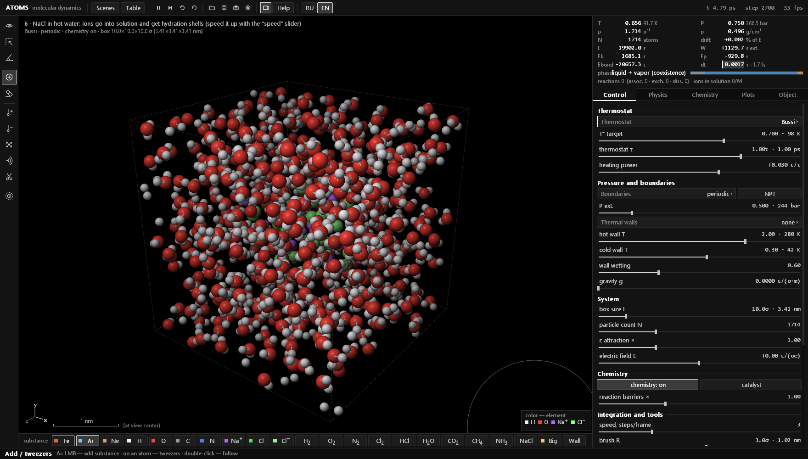

<sub>A NaCl crystal dissolving in hot water: ions leave the lattice and collect hydration shells</sub>

</div>

<br>

> [!NOTE]
> The interface is grayscale on purpose: color is kept for the atoms only, so the eye goes straight to the matter. English and Russian are switched with **RU | EN** in the top bar or <kbd>Ctrl</kbd>+<kbd>L</kbd> in the middle of a run; on first start the program follows the Windows language. Scenes are in the <kbd>Tab</kbd> menu, and everything shows a tooltip on hover.

## Features

<table>
<tr>
<td width="50%" valign="top">

**Physics**
- Full 3D: perspective camera, orbit and fly modes, section plane
- Lennard-Jones, screened Coulomb, Morse bonds, VSEPR bond angles, hydrogen bonds, many-body metallic bonding (Gupta)
- Bussi, Langevin, Nosé–Hoover and Berendsen thermostats; stochastic C-rescale barostat; piston you can drag with the mouse
- Energy bookkeeping that counts every bit of external work, so integration drift is visible

</td>
<td width="50%" valign="top">

**Chemistry**
- Bonds form, break and switch partners; reaction heat goes into motion
- Combustion, explosions, acids and bases, Grotthuss proton hopping, pH
- Catalysis on metal surfaces, photodissociation by light
- All 118 elements with a property card: electron configuration, melting and boiling points, density, ionization energy
- A library of 127 structures: from HF and NF₃ to naphthalene, glycine and fullerene C₆₀, ions, crystals and metal clusters

</td>
</tr>
<tr>
<td valign="top">

**Tools**
- Tweezers, heating and cooling brush, eraser, bond scissors, shock wave
- Field objects: attractor, heater, wind, vortex, trap, source, sink, barrier
- Selection, copy and paste, pinning atoms; ruler and protractor with dihedral angles

</td>
<td valign="top">

**Analysis**
- T, P, density and energies in model and real units (K, bar, g/cm³, ps, kJ/mol)
- Per-atom phase, the model's T–ρ phase diagram, a log of transitions
- g(r), Maxwell distribution, MSD and diffusion coefficient
- Reaction log with ΔH, k and K<sub>c</sub>; live measurements in many scenes; CSV export

</td>
</tr>
</table>

## Screenshots

<table>
<tr>
<td width="50%"><br><sub><b>Hydrogen combustion.</b> 2H₂ + O₂ → 2H₂O from a spark; event log and mixture composition on the right</sub></td>
<td width="50%"><br><sub><b>Quench.</b> A polycrystal colored by local structure: FCC grains, HCP stacking faults at the boundaries</sub></td>
</tr>
<tr>
<td>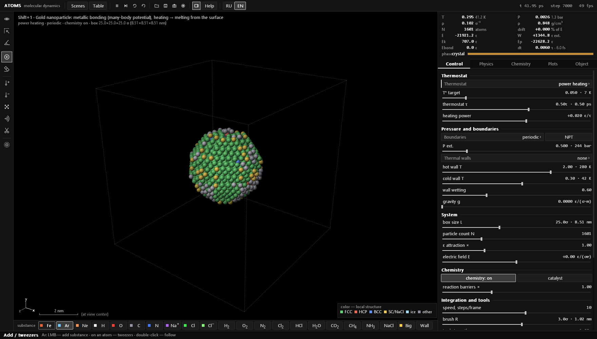<br><sub><b>Gold nanoparticle.</b> FCC inside, melting starts at the surface</sub></td>
<td>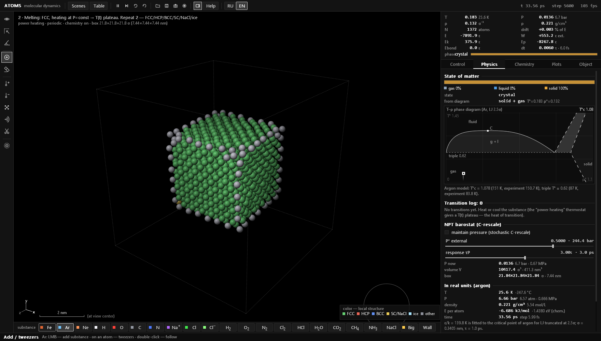<br><sub><b>Crystal melting.</b> The physics tab: the model's phase diagram and the current state</sub></td>
</tr>
<tr>
<td>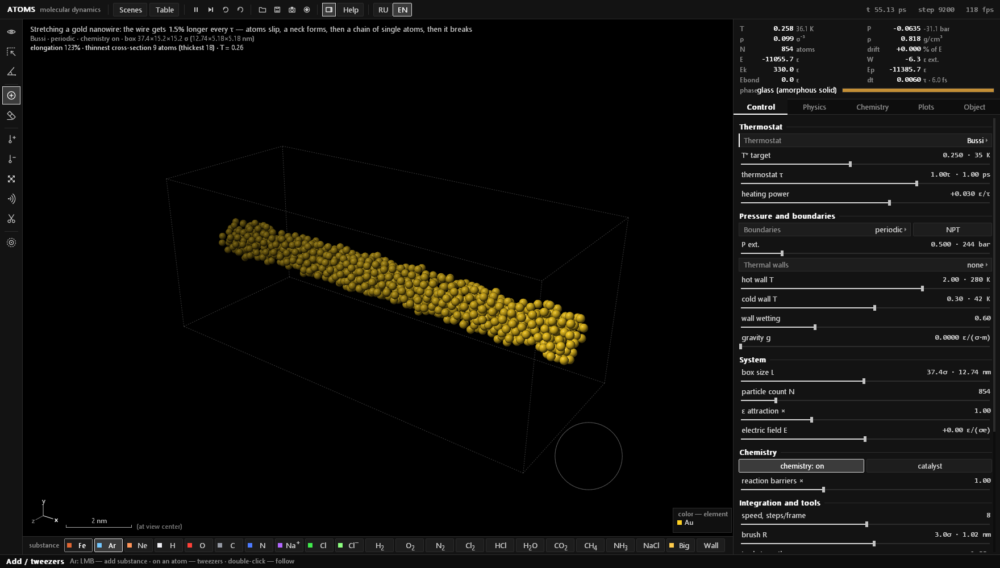<br><sub><b>Nanowire tension.</b> A gold wire is pulled until it thins down to a chain of atoms</sub></td>
<td>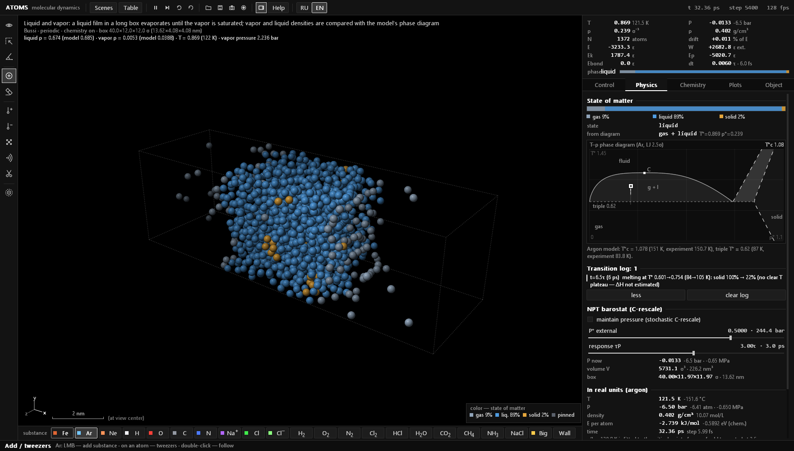<br><sub><b>Liquid and vapor.</b> A liquid film in equilibrium with its vapor; both densities are compared with the phase diagram</sub></td>
</tr>
<tr>
<td>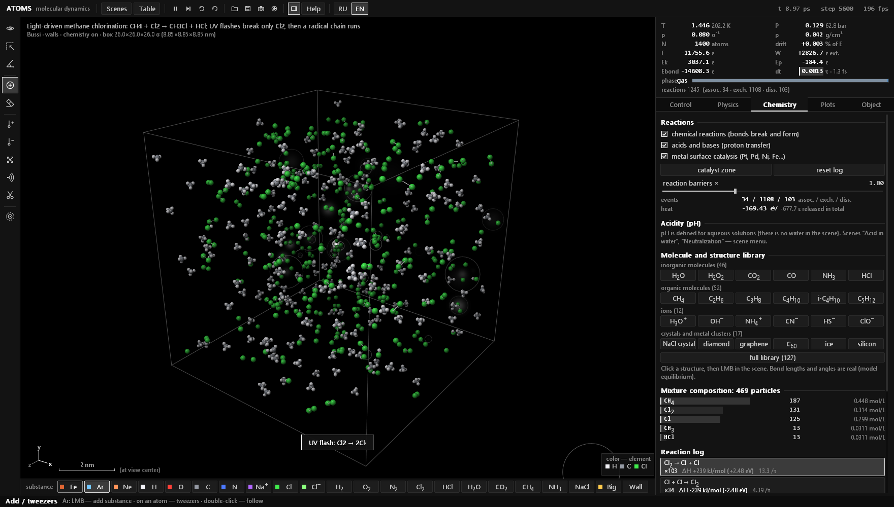<br><sub><b>Methane chlorination.</b> UV flashes split Cl₂, and a radical chain makes CH₃Cl and HCl</sub></td>
<td>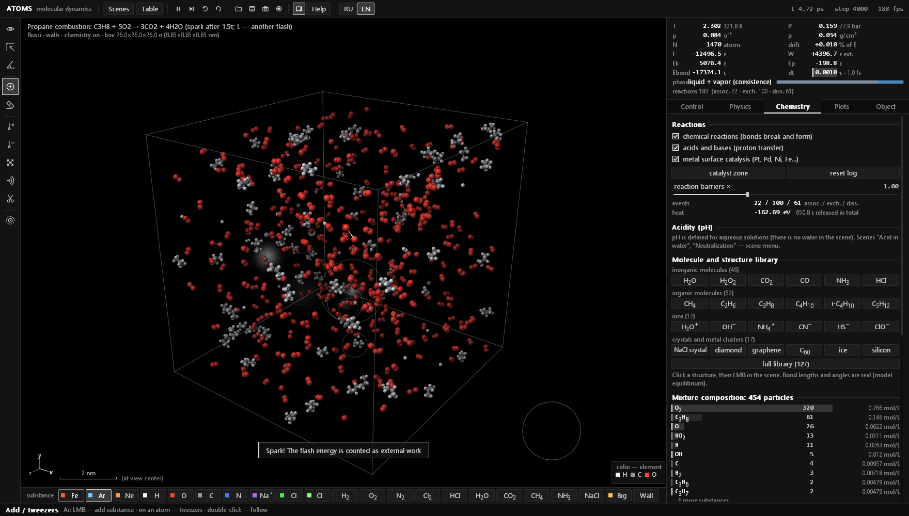<br><sub><b>Propane combustion.</b> C₃H₈ + 5O₂ from a spark, with the reaction log and rates</sub></td>
</tr>
<tr>
<td>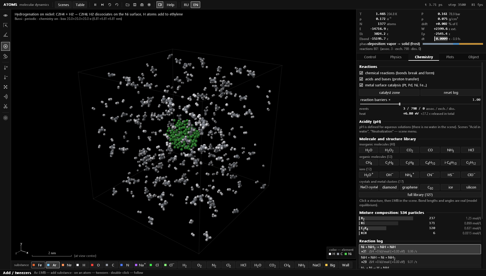<br><sub><b>Hydrogenation on nickel.</b> H₂ dissociates on a Ni cluster and adds to ethylene</sub></td>
<td>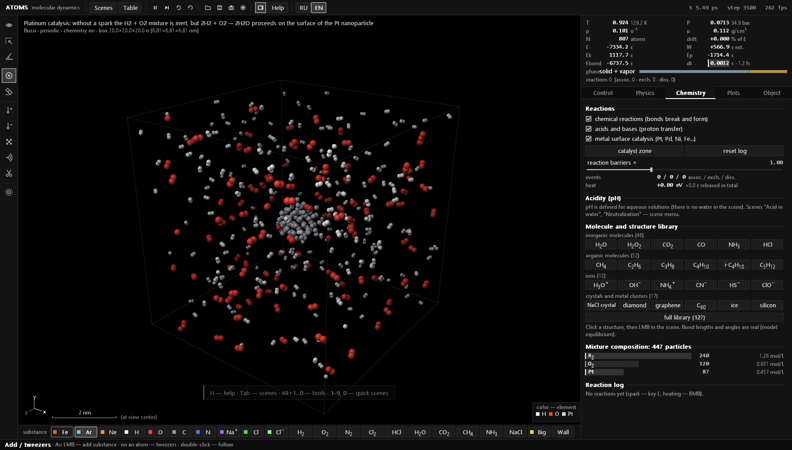<br><sub><b>Platinum catalysis.</b> H₂ and O₂ react only on the surface of a Pt nanoparticle</sub></td>
</tr>
<tr>
<td><br><sub><b>Shock tube.</b> The membrane bursts; the measured front speed is compared with theory</sub></td>
<td><br><sub><b>Heat conduction.</b> Hot and cold walls, a linear T(x) profile and κ in W/(m·K)</sub></td>
</tr>
<tr>
<td><br><sub><b>Acid in water.</b> HCl + H₂O → H₃O⁺ + Cl⁻, the pH scale and a proton-transfer counter</sub></td>
<td><br><sub><b>Condensation.</b> Supersaturated vapor gathers into droplets; plots of f(v), g(r), T, P, E, MSD</sub></td>
</tr>
<tr>
<td>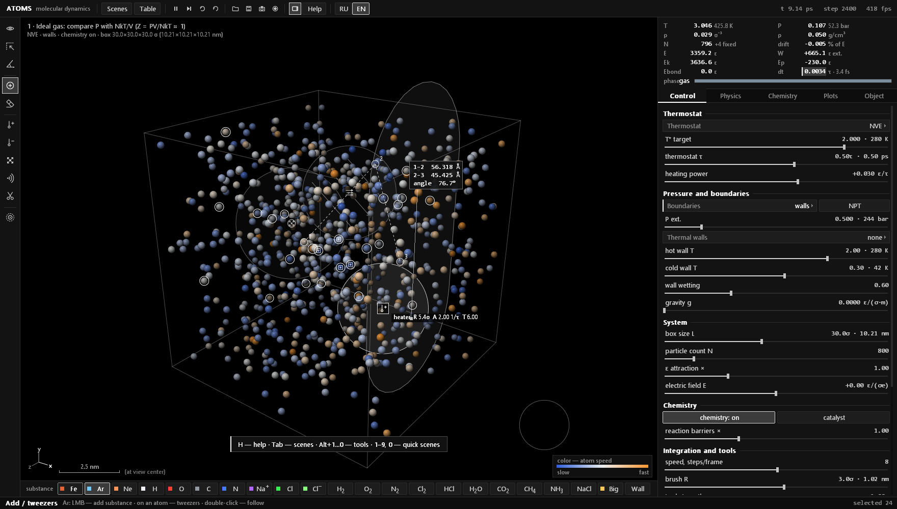<br><sub><b>Field objects and measurements.</b> A heater, a barrier, a selection and an angle measurement</sub></td>
<td><br><sub><b>Periodic table.</b> 118 elements; the card shows the electron configuration and physical properties</sub></td>
</tr>
<tr>
<td colspan="2" align="center"><br><sub><b>Scene menu.</b> 46 ready-made experiments in two sections, many with variants</sub></td>
</tr>
</table>

## Quick start

1. Download `atoms-windows-x64.zip` from [Releases](https://github.com/felixxxrrr8-afk/atoms-md/releases/latest).
2. Unzip it anywhere and run `atoms.exe`. Nothing to install.
3. <kbd>Tab</kbd> opens the scene menu, <kbd>E</kbd> the periodic table, <kbd>H</kbd> a cheat sheet, <kbd>Ctrl</kbd>+<kbd>L</kbd> switches English ↔ Russian. `MANUAL.html` next to the program is the full manual (<kbd>F1</kbd>).

Windows 10 or 11 (x64) and any OpenGL-capable GPU. SmartScreen may warn that the program is unsigned: "More info" → "Run anyway".

## Scenes

**Matter**

| Key | Scene | What to watch |
|---|---|---|
| <kbd>1</kbd> | Ideal gas | PV = NkT, Maxwell distribution, pressure on the walls |
| <kbd>2</kbd> | Crystal melting | constant-power heating, the T(t) plateau; variants: HCP, BCC, SC, NaCl, ice |
| <kbd>3</kbd> | Boiling | liquid under gravity, a hot bottom, evaporation |
| <kbd>4</kbd> | Condensation | supersaturated vapor → nuclei → droplets |
| <kbd>5</kbd> | Diffusion | two gases mixing, MSD(t) and the coefficient D |
| <kbd>8</kbd> | Brownian motion | a heavy particle among atoms, MSD ∝ t |
| <kbd>9</kbd> | Quench | polycrystal and grain boundaries; variant: glass |
| <kbd>Shift</kbd>+<kbd>1</kbd> | Gold nanoparticle | metallic bonding, surface melting |
| menu | Heat conduction | hot and cold walls, a linear T(x) profile, Fourier's law and κ |
| menu | Shock tube | shock and rarefaction waves, front speed against theory; variant: Joule expansion |
| menu | Barometric formula | ρ ∝ exp(−mgh/kT): heavy Ar stays below light Ne |
| menu | Effusion | Graham's law: He leaks through slits ≈ 3.2 times faster than Ar |
| menu | Nanoparticle sintering | Au and Ag fuse in the solid state |
| menu | Adiabatic compression | a piston slowly compresses helium: T·V<sup>γ−1</sup> ≈ const |
| menu | Wetting | contact angle of a droplet; variant: non-wetting |
| menu | Seeded crystallization | a supercooled liquid grows on a pinned crystallite |
| menu | Poiseuille flow | a parabolic velocity profile in a channel |
| menu | Liquid and vapor | a liquid film evaporates to saturation; densities against the phase diagram |
| menu | Adsorption | gas settles on attracting walls: coverage θ and pressure |
| menu | Temperature equalization | hot neon and cold krypton: equal energies, different speeds |
| menu | Cavitation | a stretched liquid tears apart into vapor bubbles |
| menu | Nanowire tension | slip, necking, an atomic chain and rupture of a gold wire |

**Chemistry**

| Key | Scene | What to watch |
|---|---|---|
| <kbd>6</kbd> | NaCl in water | salt dissolving, hydration shells |
| <kbd>7</kbd> | Hydrogen combustion | 2H₂ + O₂ → 2H₂O from a spark; variant: H₂ + Cl₂ |
| <kbd>0</kbd> | Chemical equilibrium | Cl₂ ⇌ 2Cl under a piston, Le Chatelier's principle |
| <kbd>Shift</kbd>+<kbd>2</kbd> | Iron oxidation | Fe + O₂ → oxide that flakes off |
| <kbd>Shift</kbd>+<kbd>3</kbd> | Sodium in chlorine | 2Na + Cl₂ → 2NaCl |
| <kbd>Shift</kbd>+<kbd>4</kbd> | Methane combustion | CH₄ + 2O₂ → CO₂ + 2H₂O |
| <kbd>Shift</kbd>+<kbd>5</kbd> | Electrophoresis | ions in water in an electric field, current I |
| menu | Acid in water | HCl + H₂O → H₃O⁺ + Cl⁻, Grotthuss mechanism, pH |
| menu | Neutralization | H₃O⁺ + OH⁻ → 2H₂O; variant: titration |
| menu | Ethanol combustion | C₂H₅OH + 3O₂ from a spark |
| menu | Oxyhydrogen | 2H₂ + O₂ in a closed vessel: a jump in T and P |
| menu | Platinum catalysis | the reaction runs only on the Pt surface |
| menu | Methane chlorination | a radical chain started by UV light |
| menu | Equilibrium H₂ + I₂ ⇌ 2HI | Bodenstein's experiment, K<sub>c</sub> |
| menu | Hydrogenation on nickel | C₂H₄ + H₂ → C₂H₆ |
| menu | Peroxide decomposition | 2H₂O₂ → 2H₂O + O₂ |
| menu | Acetylene combustion | 2C₂H₂ + 5O₂ → 4CO₂ + 2H₂O |
| menu | H₂ + Br₂ in light | a slower chain: Br + H₂ is endothermic |
| menu | Chlorine displaces bromine | Cl + HBr → HCl + Br |
| menu | Hydrogen and fluorine | H₂ + F₂ → 2HF without a spark |
| menu | Ozone decomposition | 2O₃ → 3O₂ on heating |
| menu | Propane combustion | C₃H₈ + 5O₂ → 3CO₂ + 4H₂O |
| menu | NCl₃ explosion | weak N–Cl bonds give way to the very strong N≡N |
| menu | Autoignition | heating without a spark up to the ignition point; variant: H₂ + Cl₂ |

## Controls

| | |
|---|---|
| <kbd>Tab</kbd> | scene menu (picking the same scene again opens its variant) |
| <kbd>Ctrl</kbd>+<kbd>L</kbd> · <kbd>F1</kbd> | interface language · the manual |
| <kbd>Space</kbd> · <kbd>S</kbd> · <kbd>R</kbd> | pause · single step · reset scene |
| <kbd>E</kbd> | periodic table |
| <kbd>Alt</kbd>+<kbd>1</kbd>…<kbd>0</kbd>, <kbd>Alt</kbd>+<kbd>F</kbd> | tools and field objects |
| LMB · RMB · <kbd>Shift</kbd>+RMB | tool · heat · cool |
| <kbd>Ctrl</kbd>+LMB, wheel | camera: rotate and zoom; <kbd>V</kbd> fly mode, <kbd>X</kbd> section plane |
| <kbd>C</kbd> · <kbd>B</kbd> · <kbd>T</kbd> | atom coloring · bonds · trails |
| <kbd>L</kbd> · <kbd>K</kbd> · <kbd>U</kbd> | flash of light · catalyst zone · reverse time |
| <kbd>Ctrl</kbd>+<kbd>Z</kbd> | undo |
| <kbd>F5</kbd> / <kbd>F9</kbd>, <kbd>Ctrl</kbd>+<kbd>S</kbd> / <kbd>Ctrl</kbd>+<kbd>O</kbd> | quick and regular save and load of `.atoms` files |
| <kbd>F12</kbd> · <kbd>Ctrl</kbd>+<kbd>F12</kbd> · <kbd>Ctrl</kbd>+<kbd>E</kbd> | PNG snapshot · frame recording · export plots to CSV |

Every key, tool and the physics behind them: [MANUAL.html](MANUAL.html) in English and [ИНСТРУКЦИЯ.html](ИНСТРУКЦИЯ.html) in Russian. Both are in the release archive.

## How it works

One simulation step (`mdStep` in [`src/physics.inl`](src/physics.inl)):

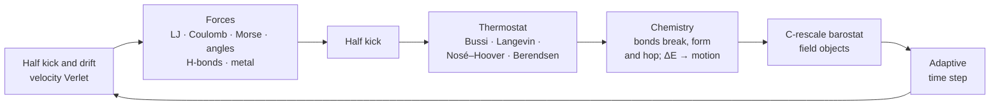

**Interactions.** Van der Waals forces use the Lennard-Jones potential with Lorentz–Berthelot mixing. Electrostatics is a screened Coulomb interaction with charges derived from electronegativities. Covalent bonds use the Morse potential, VSEPR bond angles (tetrahedral for sp³ carbon, NH₄⁺ and BH₄⁻, pyramidal for NH₃ and H₃O⁺, flat for BF₃) and multiple bonds. Hydrogen bonds use the directional DREIDING term, and water also gets a three-body tetrahedral term, as in the mW model. Metals use the many-body Gupta (Cleri–Rosato) potential.

**Chemistry.** Reactions are events inside the same molecular dynamics. A bond forms when two approaching atoms both have a free valence, breaks when it is overstretched, and an atom switches partners when it overcomes a barrier. The energy of every event is accounted for exactly, so combustion heats the mixture by itself. Bond energies and lengths come from reference tables for about 70 atom pairs (H–F, N–F, P–F, Si–F, B–F, S–Cl, interhalogens and others) and from Pauling's rules for the rest. Barriers follow the Evans–Polanyi rule.

**Units.** The model is calibrated to argon: σ = 0.3405 nm, and ε/k = 139.8 K is chosen so that the model's critical point matches argon's (150.7 K). The triple point then comes out at ≈ 87 K against the measured 83.8 K, and the liquid density near it at 1.39 g/cm³ against 1.41.

**Robustness.** A stability guard keeps state snapshots and, if the simulation blows up, rolls back and continues with a smaller step. Everything the user does is counted as external work W, so E − W is conserved and its drift shows how honest the integration is.

### Headless checks

```bash
atoms.exe --selftest                 # every scene in the menu: stability, energy drift, NaN
atoms.exe --gradcheck K N            # forces against −∇U by numerical differentiation
atoms.exe --evcheck K N              # exact energy balance of every reaction
atoms.exe --kin K N T V              # long run of a scene: phase, reactions, live measurement
atoms.exe --phystest MODE K N        # coex, melt, triple, npt, vir, fo, guard
atoms.exe --chemtest lib             # insert every library structure and check it stays intact
atoms.exe --uitest [--langcheck]     # click through the whole interface; list untranslated strings
atoms.exe --lang en --shot K N png   # render scene K and save a window snapshot
```

Reports go to `.log` files next to the program. The screenshots here were made with `--shot`.

## Building from source

No external libraries: MSVC from Visual Studio or Build Tools is enough.

```bash
build.bat
```

`build.bat` finds Visual Studio by itself; `build.bat asan` builds a debug version with AddressSanitizer. By hand, from an x64 Native Tools Command Prompt:

```bash
rc /nologo atoms.rc
cl /O2 /openmp /utf-8 /EHsc /std:c++17 /fp:fast main.cpp atoms.res /Fe:atoms.exe /link /SUBSYSTEM:WINDOWS user32.lib gdi32.lib opengl32.lib comdlg32.lib shell32.lib
```

Every push to `main` is built by [GitHub Actions](https://github.com/felixxxrrr8-afk/atoms-md/actions); a new `ProductVersion` in `atoms.rc` publishes a new release.

### Layout

One translation unit: `main.cpp` includes the modules from `src/` in order, about 10,000 lines plus the translation table. Comments in the code are in Russian.

| File | Contents |
|---|---|
| [`main.cpp`](main.cpp) | entry point and the list of headless modes |
| [`src/core.inl`](src/core.inl) | constants, elements and their properties, system state |
| [`src/physics.inl`](src/physics.inl) | forces, neighbor lists, integrator, thermostats, barostat, field objects, stability guard |
| [`src/chemistry.inl`](src/chemistry.inl) | reactions, charges and ions, pH, bond table, the structure library |
| [`src/analysis.inl`](src/analysis.inl) | measurements for plots, local structure, per-atom phase |
| [`src/presets.inl`](src/presets.inl) | scenes, their live measurements, undo |
| [`src/render.inl`](src/render.inl) | OpenGL rendering and the camera |
| [`src/ui.inl`](src/ui.inl) | panels, tools, plots, periodic table, scene menu |
| [`src/panel_phys.inl`](src/panel_phys.inl), [`src/panel_chem.inl`](src/panel_chem.inl) | the Physics and Chemistry tabs and their headless checks |
| [`src/app.inl`](src/app.inl) | window and main loop, input, saving, PNG, self-tests |
| [`src/lang.inl`](src/lang.inl), [`src/lang_table.inl`](src/lang_table.inl) | language switching and the Russian → English string table |
| [`tools/i18n.py`](tools/i18n.py) | extracts interface strings and checks the translation table |

## Simplifications

The mechanics are classical, with no quantum effects. Each atom pair has a single bond curve, and electron transfer is not modeled explicitly: oxidation happens through bonds. Hypervalent molecules (SO₂, SF₆, PCl₅, HNO₃) are out of reach of the valence model. Bond energies are scaled down (1 eV = 4ε) and reactions are sped up, otherwise nothing would happen within a reachable simulation time. Water autoionization is left out: in a box of ~10⁻²³ L its equilibrium is zero ions.

## License

[GPL-3.0](LICENSE). You may use, study and modify the code; derived programs must be distributed with source code under the same license.
