<div align="center">

**English** · [Русский](README.ru.md)


# Atoms

**A real-time molecular dynamics and chemistry sandbox, in 2D and 3D By felinebut(telegram channel-@felinebut67 )**

Gas, liquid, crystal, phase transitions and chemical reactions are not scripted here:<br>
they emerge on their own from interaction potentials and conservation laws.

[](https://github.com/felixxxrrr8-afk/atoms-md/actions/workflows/build.yml)
[](https://github.com/felixxxrrr8-afk/atoms-md/releases/latest)


[](LICENSE)

### [⬇ Download for Windows](https://github.com/felixxxrrr8-afk/atoms-md/releases/latest)

[Features](#features) · [Scenes](#scenes) · [Controls](#controls) · [How it works](#how-it-works) · [Building](#building-from-source)

<br>

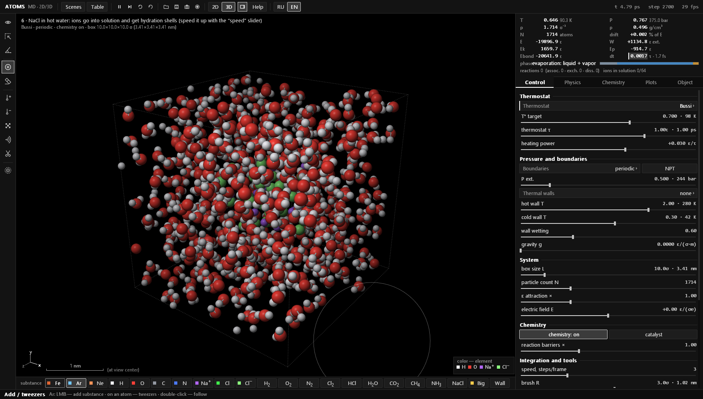

<sub>A NaCl crystal dissolving in hot water: ions leave the lattice and collect hydration shells</sub>

</div>

<br>

> [!NOTE]
> The interface speaks English and Russian: switch with the **RU | EN** buttons in the top bar or <kbd>Ctrl</kbd>+<kbd>L</kbd>, right in the middle of a simulation. The choice is remembered; on first start the program follows the Windows language. Scenes start from the <kbd>Tab</kbd> menu, and every button, slider and atom shows a tooltip on hover.

## Features

<table>
<tr>
<td width="50%" valign="top">

**Physics**
- 2D and 3D, switched with a single key <kbd>D</kbd>
- Lennard-Jones, screened Coulomb, Morse bonds, bond angles, hydrogen bonds, many-body metallic bonding
- Bussi, Langevin, Nosé–Hoover and Berendsen thermostats; NPT barostat
- Energy bookkeeping that includes all external work, so integration drift is visible on a plot

</td>
<td width="50%" valign="top">

**Chemistry**
- Bonds form, break and hop between atoms; reaction heat turns into motion
- Combustion, acids and bases, Grotthuss proton hopping, pH
- Catalysis on metal surfaces, photodissociation by light
- All 118 elements with a property card: electron configuration, melting and boiling points, density, ionization energy
- A library of 65 structures: inorganic and organic molecules, ions, crystals, metal clusters

</td>
</tr>
<tr>
<td valign="top">

**Tools**
- Tweezers, heating and cooling brush, eraser, bond scissors, shock wave
- Field objects: attractor, heater, wind, vortex, trap, source, sink, barrier
- Selection, copy and paste, pinning atoms; ruler and protractor
- A monochrome interface where only the atoms keep their colors; English and Russian

</td>
<td valign="top">

**Analysis**
- T, P, density and energies in both model and real units
- Per-atom phase, T–ρ phase diagram, transition log
- g(r), Maxwell distribution, MSD and diffusion coefficient
- Reaction log with ΔH, k and K<sub>c</sub>; plot export to CSV

</td>
</tr>
</table>

## Screenshots

<table>
<tr>
<td width="50%"><br><sub><b>Quench.</b> A polycrystal colored by grain orientation, with grain boundaries and dislocations</sub></td>
<td width="50%">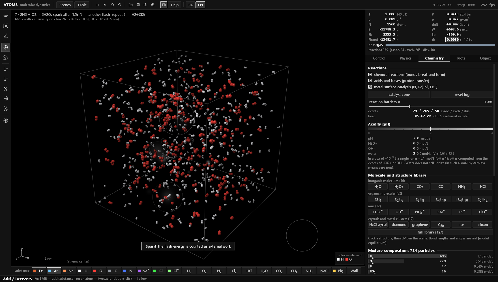<br><sub><b>Hydrogen combustion.</b> 2H₂ + O₂ → 2H₂O from a spark; event log and mixture composition on the right</sub></td>
</tr>
<tr>
<td><br><sub><b>Gold nanoparticle.</b> Colored by local structure: FCC inside, melting starts at the surface</sub></td>
<td><br><sub><b>Crystal melting.</b> The physics tab: the model's phase diagram and the current state</sub></td>
</tr>
<tr>
<td>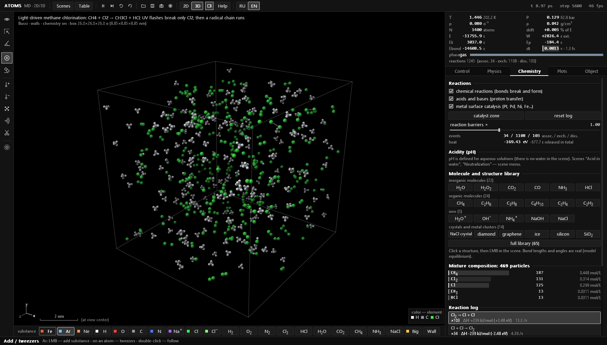<br><sub><b>Methane chlorination.</b> UV flashes split Cl₂, a radical chain makes CH₃Cl and HCl; the molecule library on the right</sub></td>
<td>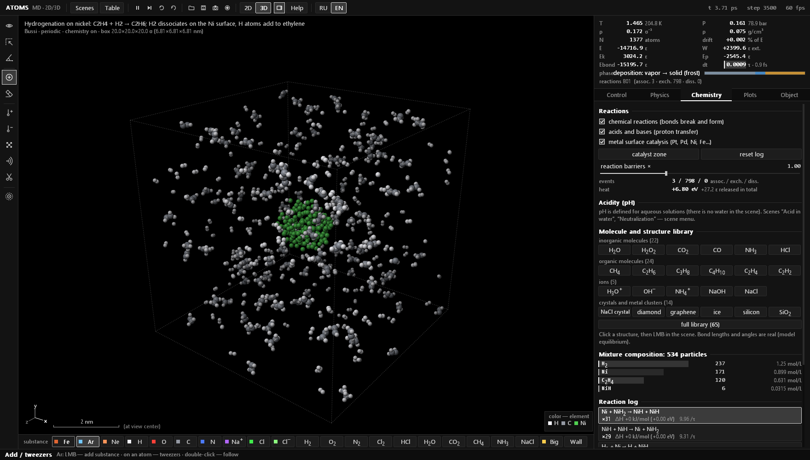<br><sub><b>Hydrogenation on nickel.</b> H₂ dissociates on a Ni cluster and adds to ethylene: C₂H₄ + H₂ → C₂H₆</sub></td>
</tr>
<tr>
<td>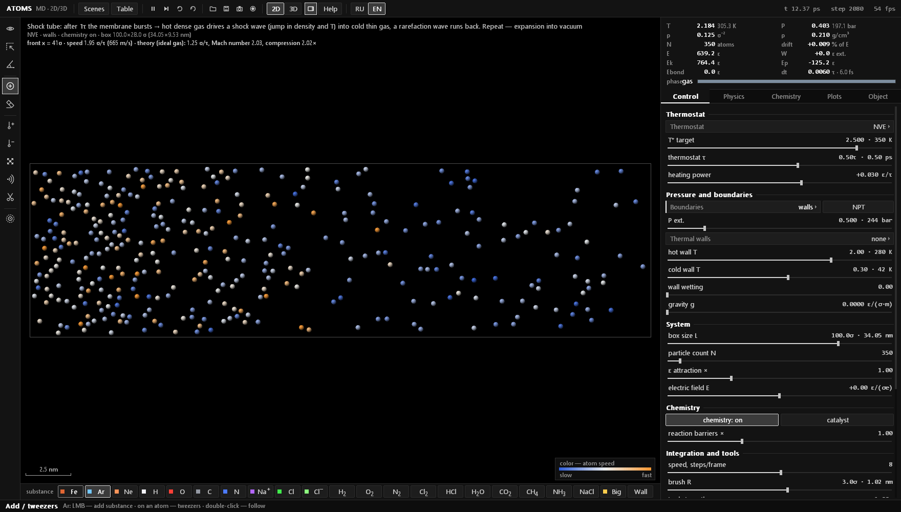<br><sub><b>Shock tube.</b> The membrane bursts: a shock wave runs into the thin gas; the measured front speed is compared with theory</sub></td>
<td>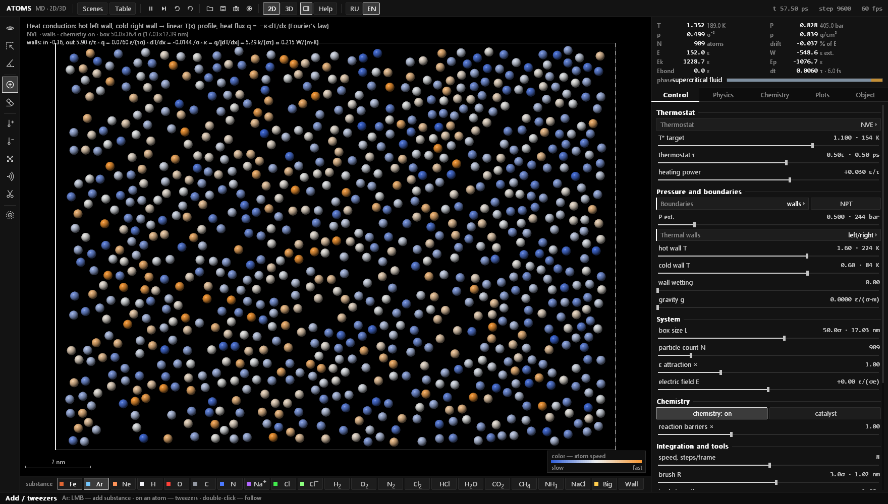<br><sub><b>Heat conduction.</b> Hot and cold walls, a linear T(x) profile and the thermal conductivity κ in W/(m·K)</sub></td>
</tr>
<tr>
<td>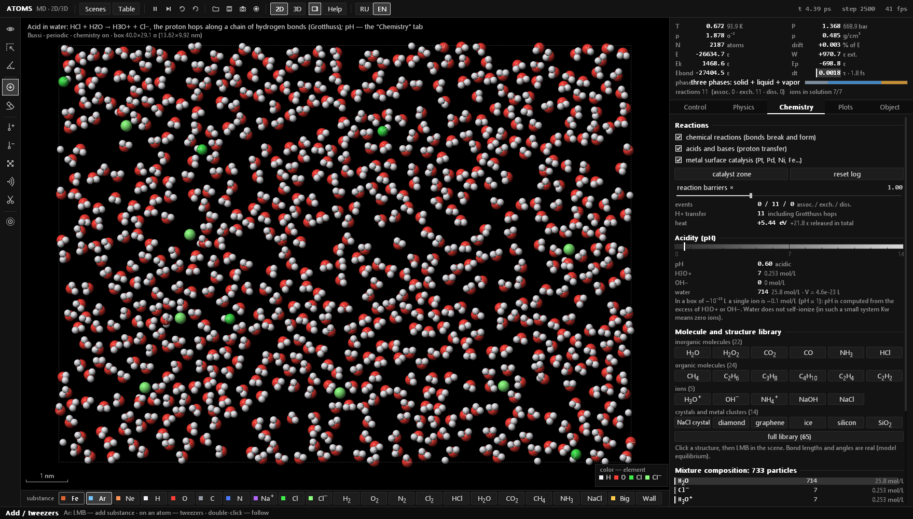<br><sub><b>Acid in water.</b> HCl + H₂O → H₃O⁺ + Cl⁻, a pH scale and a proton transfer counter</sub></td>
<td>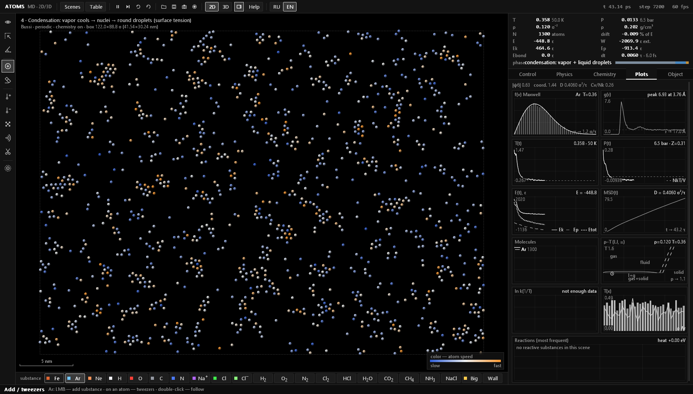<br><sub><b>Condensation.</b> Supersaturated vapor gathers into droplets; plots of f(v), g(r), T, P, E, MSD</sub></td>
</tr>
<tr>
<td>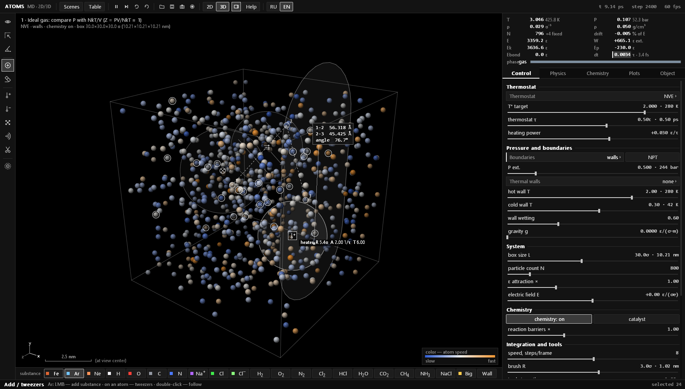<br><sub><b>Field objects and measurements.</b> A heater, a barrier, a selection and an angle measurement in 3D</sub></td>
<td>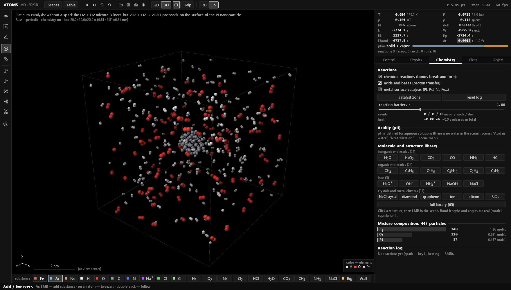<br><sub><b>Platinum catalysis.</b> H₂ and O₂ react only on the surface of a Pt nanoparticle</sub></td>
</tr>
<tr>
<td>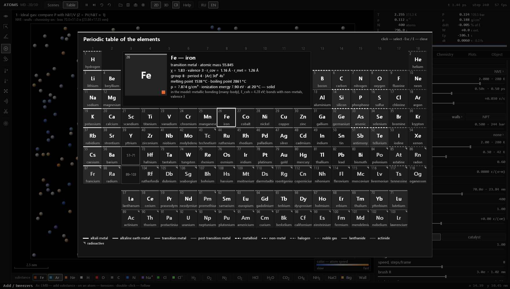<br><sub><b>Periodic table.</b> 118 elements; the card shows the electron configuration, melting and boiling points, density, ionization energy and how the element is modeled</sub></td>
<td>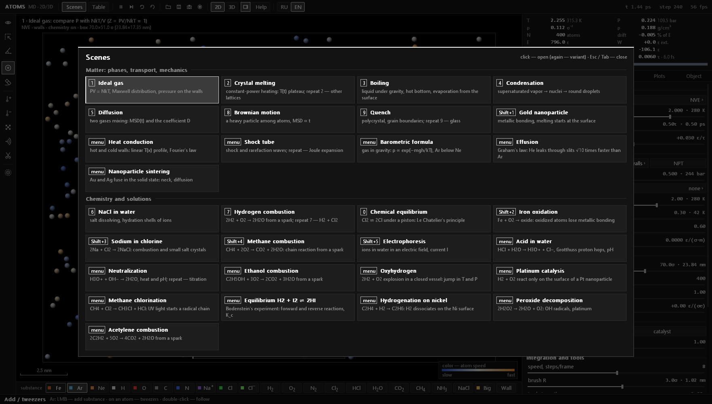<br><sub><b>Scene menu.</b> 30 ready-made experiments in two sections, many with variants</sub></td>
</tr>
</table>

## Quick start

1. Download `atoms-windows-x64.zip` from [Releases](https://github.com/felixxxrrr8-afk/atoms-md/releases/latest).
2. Unzip it anywhere and run `atoms.exe`. Nothing to install.
3. <kbd>Tab</kbd> opens the scene menu, <kbd>D</kbd> toggles 2D ↔ 3D, <kbd>E</kbd> opens the periodic table, <kbd>H</kbd> shows a cheat sheet, <kbd>Ctrl</kbd>+<kbd>L</kbd> switches English ↔ Russian. `MANUAL.html` next to the program is the full manual.

Requires Windows 10 or 11 (x64) and any OpenGL-capable GPU. SmartScreen may warn that the program is unsigned: click "More info" → "Run anyway".

## Scenes

| Key | Scene | What to watch |
|---|---|---|
| <kbd>1</kbd> | Ideal gas | PV = NkT, Maxwell distribution, pressure on the walls |
| <kbd>2</kbd> | Crystal melting | constant-power heating, the T(t) plateau; variants use other lattices |
| <kbd>3</kbd> | Boiling | liquid under gravity, a hot bottom, evaporation |
| <kbd>4</kbd> | Condensation | supersaturated vapor → nuclei → droplets |
| <kbd>5</kbd> | Diffusion | two gases mixing, MSD(t) and the coefficient D |
| <kbd>6</kbd> | NaCl in water | salt dissolving, hydration shells |
| <kbd>7</kbd> | Hydrogen combustion | 2H₂ + O₂ → 2H₂O from a spark; variant: H₂ + Cl₂ |
| <kbd>8</kbd> | Brownian motion | a heavy particle, MSD ∝ t |
| <kbd>9</kbd> | Quench | polycrystal and grain boundaries; variant: glass |
| <kbd>0</kbd> | Chemical equilibrium | Cl₂ ⇌ 2Cl under a piston, Le Chatelier's principle |
| <kbd>Shift</kbd>+<kbd>1</kbd> | Gold nanoparticle | metallic bonding, surface melting |
| <kbd>Shift</kbd>+<kbd>2</kbd> | Iron oxidation | Fe + O₂ → oxide |
| <kbd>Shift</kbd>+<kbd>3</kbd> | Sodium in chlorine | 2Na + Cl₂ → 2NaCl |
| <kbd>Shift</kbd>+<kbd>4</kbd> | Methane combustion | CH₄ + 2O₂ → CO₂ + 2H₂O |
| <kbd>Shift</kbd>+<kbd>5</kbd> | Electrophoresis | ions in water in an electric field, current I |
| menu | Acid in water | HCl + H₂O → H₃O⁺ + Cl⁻, Grotthuss mechanism, pH ≈ 0.3 |
| menu | Neutralization | H₃O⁺ + OH⁻ → 2H₂O, pH moves toward 7; variant: titration |
| menu | Ethanol combustion | C₂H₅OH + 3O₂ from a spark |
| menu | Oxyhydrogen | 2H₂ + O₂ in a closed vessel: a jump in T and P |
| menu | Platinum catalysis | the reaction runs only on the Pt surface |
| menu | Heat conduction | hot and cold walls, a linear T(x) profile, Fourier's law and κ |
| menu | Shock tube | shock and rarefaction waves, front speed against theory; variant: Joule expansion |
| menu | Barometric formula | gas under gravity, ρ ∝ exp(−mgh/kT): heavy Ar stays below light Ne |
| menu | Effusion | Graham's law: He leaks through slits √10 ≈ 3.2 times faster than Ar |
| menu | Nanoparticle sintering | Au and Ag fuse in the solid state: a neck grows, atoms intermix |
| menu | Methane chlorination | CH₄ + Cl₂ → CH₃Cl + HCl, a radical chain started by UV light |
| menu | Equilibrium H₂ + I₂ ⇌ 2HI | Bodenstein's experiment: forward and reverse reactions, K<sub>c</sub> |
| menu | Hydrogenation on nickel | C₂H₄ + H₂ → C₂H₆, H₂ dissociates on the Ni surface |
| menu | Peroxide decomposition | 2H₂O₂ → 2H₂O + O₂: OH radicals, platinum |
| menu | Acetylene combustion | 2C₂H₂ + 5O₂ → 4CO₂ + 2H₂O from a spark |

## Controls

| | |
|---|---|
| <kbd>Tab</kbd> | scene menu (picking the same scene again opens its variant) |
| <kbd>Ctrl</kbd>+<kbd>L</kbd> | interface language: English / Russian |
| <kbd>F1</kbd> | the manual in the current language |
| <kbd>D</kbd> | 2D / 3D |
| <kbd>Space</kbd> · <kbd>S</kbd> · <kbd>R</kbd> | pause · single step · reset scene |
| <kbd>E</kbd> | periodic table |
| <kbd>Alt</kbd>+<kbd>1</kbd>…<kbd>0</kbd>, <kbd>Alt</kbd>+<kbd>F</kbd> | tools and field objects |
| LMB · RMB · <kbd>Shift</kbd>+RMB | tool · heat · cool |
| <kbd>Ctrl</kbd>+LMB, wheel | camera: rotate and zoom |
| <kbd>C</kbd> · <kbd>B</kbd> · <kbd>T</kbd> | atom coloring · bonds · trails |
| <kbd>L</kbd> · <kbd>K</kbd> | flash of light · catalyst zone |
| <kbd>U</kbd> | reverse time |
| <kbd>Ctrl</kbd>+<kbd>Z</kbd> | undo |
| <kbd>F5</kbd> / <kbd>F9</kbd>, <kbd>Ctrl</kbd>+<kbd>S</kbd> / <kbd>Ctrl</kbd>+<kbd>O</kbd> | quick and regular save and load of `.atoms` files |
| <kbd>F12</kbd> · <kbd>Ctrl</kbd>+<kbd>F12</kbd> · <kbd>Ctrl</kbd>+<kbd>E</kbd> | PNG snapshot · frame recording · export plots to CSV |

The full manual with every key, tool and the physics behind them: [MANUAL.html](MANUAL.html) in English and [ИНСТРУКЦИЯ.html](ИНСТРУКЦИЯ.html) in Russian. Both come in the release archive; <kbd>F1</kbd> in the program opens the one that matches the interface language.

## How it works

One simulation step (`mdStep` in [`src/physics.inl`](src/physics.inl)):

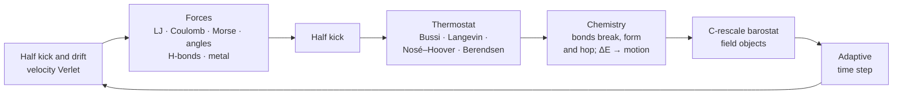

**Interactions.** Van der Waals forces use the Lennard-Jones potential with Lorentz–Berthelot mixing rules. Electrostatics is a screened Coulomb interaction, with atomic charges derived from electronegativities. Covalent bonds use the Morse potential, VSEPR bond angles and multiple bonds. Hydrogen bonds use the directional DREIDING term, and water also gets a three-body tetrahedral term, as in the mW model. Metals use the many-body Gupta (Cleri–Rosato) potential, so surfaces, melting and nanoparticle faceting behave plausibly.

**Chemistry.** Reactions are events inside the same molecular dynamics, not animations. A bond forms when two approaching atoms both have a free valence, breaks when it is overstretched, and an atom switches partners when it overcomes a barrier. The energy of every event is accounted for exactly, so combustion heats the mixture by itself. Bond energies come from tables for about 70 atom pairs and from Pauling's rules for the rest. Barriers follow the Evans–Polanyi rule.

**Units.** The model is calibrated to argon: σ = 0.3405 nm, and ε/k = 139.8 K is chosen so that the model's critical point matches argon's (150.7 K). The triple point then comes out at ≈ 87 K against the measured 83.8 K. The program shows both model and real quantities everywhere: K, bar, g/cm³, ps, kJ/mol.

**Robustness.** A stability guard keeps state snapshots and, if the simulation blows up, rolls back and continues with a smaller step. Everything the user does (heating, pushing, inserting atoms) is counted as external work W, so E − W is conserved and its drift shows how honest the integration is.

### Headless checks

```bash
atoms.exe --selftest                 # every scene in 2D and 3D: stability, energy drift, NaN
atoms.exe --gradcheck D K N          # forces against −∇U by numerical differentiation
atoms.exe --evcheck D K N            # exact energy balance of every reaction
atoms.exe --kin K D N T V            # long run of a scene: phase, reactions, composition
atoms.exe --phystest MODE D K N      # coex, melt, npt, vir, fo, guard
atoms.exe --chemtest lib D           # insert every library structure and check it stays intact
atoms.exe --uitest [--langcheck]     # click through the whole interface; list untranslated strings
atoms.exe --lang en --shot K N [3d] png   # render scene K and save a window snapshot
```

Reports are written to `.log` files next to the program. The screenshots in this README were made with `--shot`.

## Building from source

There are no external libraries: MSVC from Visual Studio or Build Tools is enough (C++17, Win32, OpenGL 1.x, OpenMP).

```bash
build.bat
```

`build.bat` finds Visual Studio on its own and builds `atoms.exe` next to the sources. `build.bat asan` builds a debug version with AddressSanitizer. By hand, from an x64 Native Tools Command Prompt:

```bash
rc /nologo atoms.rc
cl /O2 /openmp /utf-8 /EHsc /std:c++17 /fp:fast main.cpp atoms.res /Fe:atoms.exe /link /SUBSYSTEM:WINDOWS user32.lib gdi32.lib opengl32.lib comdlg32.lib shell32.lib
```

Every push to `main` is built by [GitHub Actions](https://github.com/felixxxrrr8-afk/atoms-md/actions), and the release for the current version gets the fresh archive. When `ProductVersion` in `atoms.rc` changes, a new release is published automatically.

### Layout

The whole program is a single translation unit: `main.cpp` includes the modules from `src/` in order, about 10,000 lines of code plus the translation table. Code comments are in Russian.

| File | Contents |
|---|---|
| [`main.cpp`](main.cpp) | entry point, module include order |
| [`src/core.inl`](src/core.inl) | constants, elements, system state |
| [`src/physics.inl`](src/physics.inl) | energies and forces, neighbor lists, integrator, thermostats, barostat, field objects, stability guard |
| [`src/chemistry.inl`](src/chemistry.inl) | reactions, molecules and charges, ionic events, pH, structure library |
| [`src/analysis.inl`](src/analysis.inl) | measurements for plots, per-atom phase detection |
| [`src/presets.inl`](src/presets.inl) | scenes and their variants, undo |
| [`src/render.inl`](src/render.inl) | 2D and 3D OpenGL rendering, camera |
| [`src/ui.inl`](src/ui.inl) | interface: panels, tools, plots, periodic table, scene menu |
| [`src/panel_phys.inl`](src/panel_phys.inl), [`src/panel_chem.inl`](src/panel_chem.inl) | the Physics and Chemistry tabs and their headless checks |
| [`src/app.inl`](src/app.inl) | window and main loop, keyboard and mouse, saving, PNG, self-tests |
| [`src/lang.inl`](src/lang.inl), [`src/lang_table.inl`](src/lang_table.inl) | interface language switching and the Russian → English string table |
| [`tools/i18n.py`](tools/i18n.py) | extracts interface strings, checks the translation table (`check`, `todo`, `merge`) |

## Simplifications

The mechanics are classical, with no quantum effects. Each atom pair has a single bond curve, and electron transfer is not modeled explicitly: oxidation happens through bonds. Bond energies are scaled down (1 eV = 4ε) and reaction rates are sped up, otherwise nothing would happen within a reachable simulation time. Water autoionization is left out: in a box of ~10⁻²³ L its equilibrium is zero ions.

## License

[GPL-3.0](LICENSE). You may use, study and modify the code; derived programs must also be distributed with source code under GPL-3.0.
