<div align="center">

[English](README.md) · **Русский**


# Атомы

**Молекулярная динамика и химия в реальном времени**

Автор — **felinebut** · Telegram-канал [@felinebut67](https://t.me/felinebut67)

Газ, жидкость, кристалл, фазовые переходы и химические реакции здесь не нарисованы заранее:<br>
они получаются из потенциалов взаимодействия и законов сохранения.

[](https://github.com/felixxxrrr8-afk/atoms-md/actions/workflows/build.yml)
[](https://github.com/felixxxrrr8-afk/atoms-md/releases/latest)


[](LICENSE)

### [Скачать для Windows](https://github.com/felixxxrrr8-afk/atoms-md/releases/latest)

[Возможности](#возможности) · [Сцены](#сцены) · [Управление](#управление) · [Как это устроено](#как-это-устроено) · [Сборка](#сборка-из-исходников)

<br>

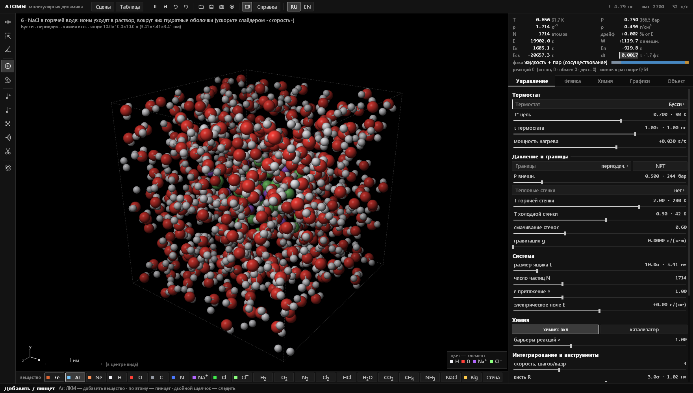

<sub>Кристаллик NaCl растворяется в горячей воде: ионы уходят в раствор, вокруг них собираются гидратные оболочки</sub>

</div>

<br>

> [!NOTE]
> Интерфейс нарочно серый: цвет оставлен только атомам, чтобы глаз сразу шёл к веществу. Язык переключается кнопками **RU | EN** в верхней панели или <kbd>Ctrl</kbd>+<kbd>L</kbd> прямо во время моделирования; при первом запуске берётся язык Windows. Сцены — в меню <kbd>Tab</kbd>, у всего есть подсказка при наведении.

## Возможности

<table>
<tr>
<td width="50%" valign="top">

**Физика**
- Полностью объёмная модель: перспективная камера, орбита и полёт, плоскость разреза
- Леннард-Джонс, экранированный кулон, связи Морзе, валентные углы по VSEPR, водородные связи, многочастичная металлическая связь (Гупта)
- Термостаты Бусси, Ланжевена, Нозе–Гувера, Берендсена; стохастический баростат C-rescale; поршень можно тянуть мышью
- Баланс энергии с учётом всей работы извне: дрейф интегрирования виден сразу

</td>
<td width="50%" valign="top">

**Химия**
- Связи образуются, рвутся и переходят между атомами; теплота реакции уходит в движение
- Горение, взрывы, кислоты и основания, прыжки протона по Гроттгусу, pH
- Катализ на поверхности металлов, фотодиссоциация светом
- Все 118 элементов с карточкой свойств: электронная конфигурация, t плавления и кипения, плотность, энергия ионизации
- Библиотека из 127 структур: от HF и NF₃ до нафталина, глицина и фуллерена C₆₀, ионы, кристаллы, кластеры металлов

</td>
</tr>
<tr>
<td valign="top">

**Инструменты**
- Пинцет, кисть нагрева и охлаждения, ластик, ножницы для связей, ударная волна
- Объекты поля: притягатель, нагреватель, ветер, вихрь, ловушка, источник, сток, барьер
- Выделение, копирование, закрепление атомов; линейка и угломер с двугранными углами

</td>
<td valign="top">

**Анализ**
- T, P, плотность и энергии в модельных и настоящих единицах (K, бар, г/см³, пс, кДж/моль)
- Фаза каждого атома, фазовая диаграмма модели T–ρ, журнал переходов
- g(r), распределение Максвелла, MSD и коэффициент диффузии
- Журнал реакций с ΔH, k и K<sub>c</sub>; живые измерения во многих сценах; экспорт в CSV

</td>
</tr>
</table>

## Скриншоты

<table>
<tr>
<td width="50%"><br><sub><b>Горение водорода.</b> 2H₂ + O₂ → 2H₂O от искры, справа — журнал событий и состав смеси</sub></td>
<td width="50%"><br><sub><b>Закалка.</b> Поликристалл, цвет — локальная структура: зёрна ГЦК, дефекты упаковки ГПУ на границах</sub></td>
</tr>
<tr>
<td>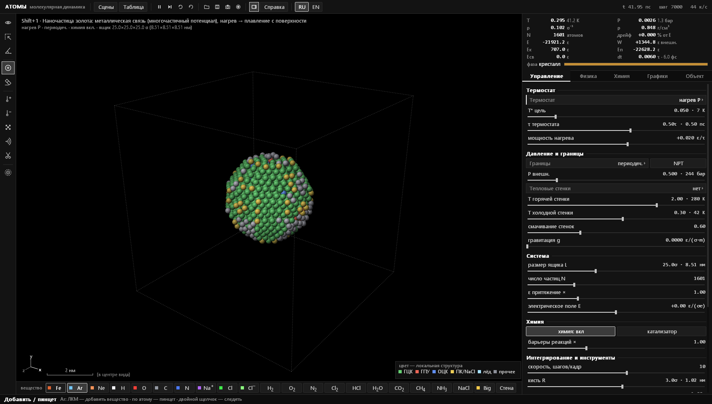<br><sub><b>Наночастица золота.</b> ГЦК внутри, плавление начинается с поверхности</sub></td>
<td>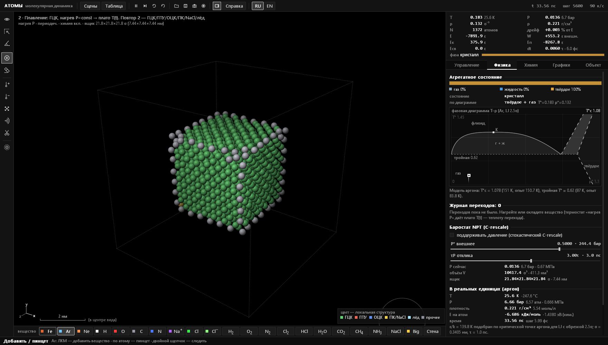<br><sub><b>Плавление кристалла.</b> Вкладка «Физика»: фазовая диаграмма модели и текущее состояние</sub></td>
</tr>
<tr>
<td>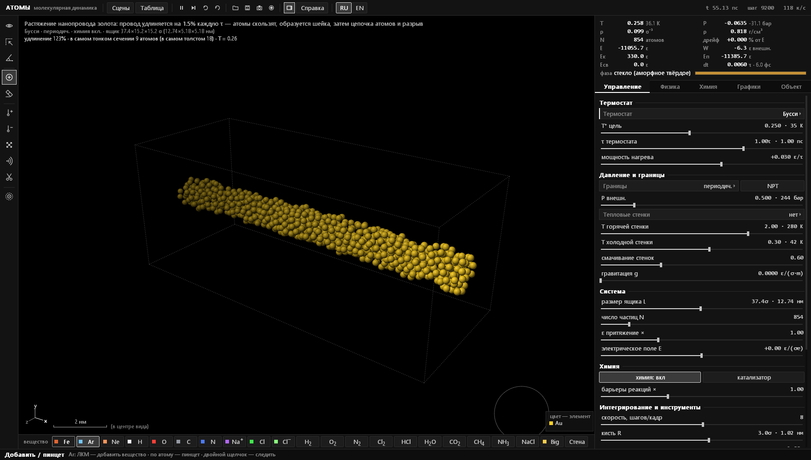<br><sub><b>Растяжение нанопровода.</b> Провод золота тянут, пока он не истончится до цепочки атомов</sub></td>
<td>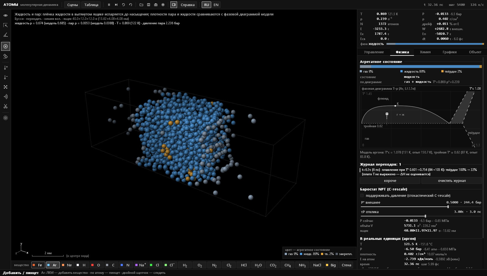<br><sub><b>Жидкость и пар.</b> Плёнка жидкости в равновесии со своим паром; плотности сравниваются с фазовой диаграммой</sub></td>
</tr>
<tr>
<td>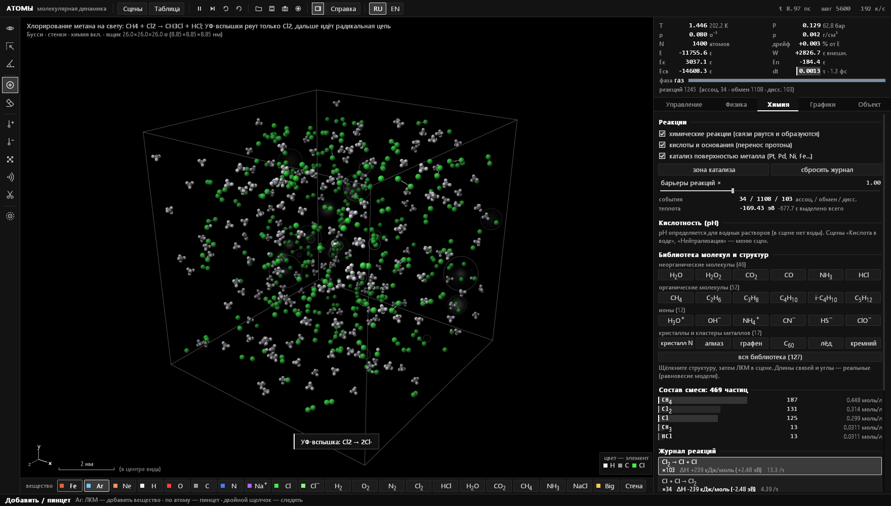<br><sub><b>Хлорирование метана.</b> УФ-вспышки рвут Cl₂, радикальная цепь даёт CH₃Cl и HCl</sub></td>
<td>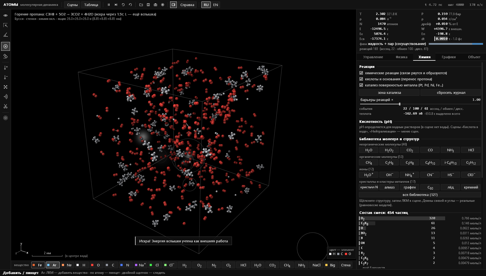<br><sub><b>Горение пропана.</b> C₃H₈ + 5O₂ от искры, журнал реакций и скорости</sub></td>
</tr>
<tr>
<td>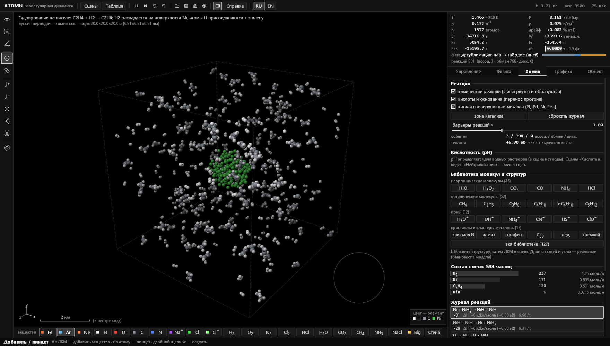<br><sub><b>Гидрирование на никеле.</b> H₂ распадается на кластере Ni и присоединяется к этилену</sub></td>
<td>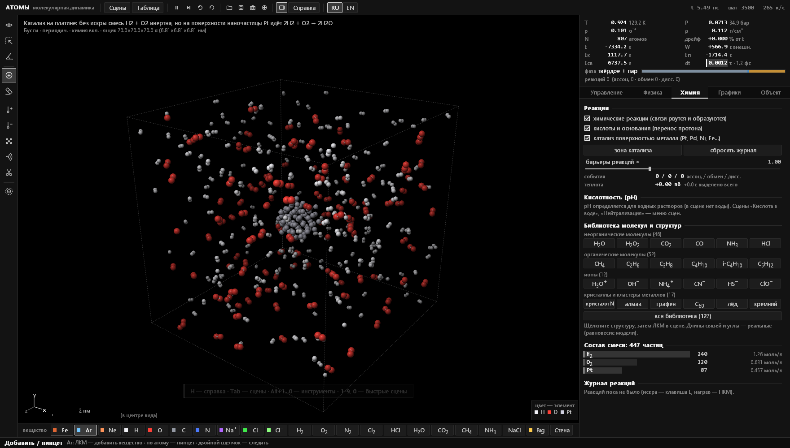<br><sub><b>Катализ на платине.</b> H₂ и O₂ реагируют только на поверхности наночастицы Pt</sub></td>
</tr>
<tr>
<td>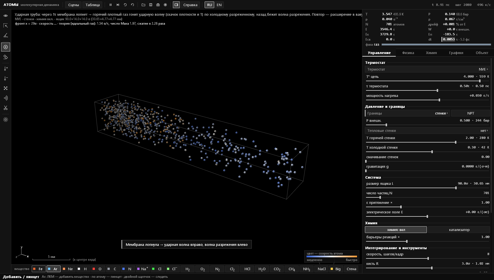<br><sub><b>Ударная труба.</b> Мембрана лопнула; скорость фронта сравнивается с теорией</sub></td>
<td>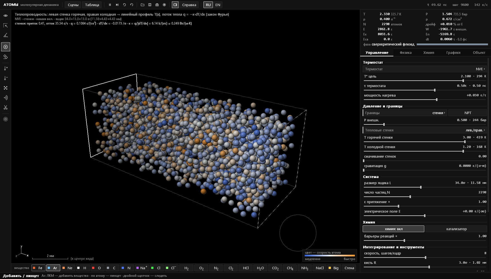<br><sub><b>Теплопроводность.</b> Горячая и холодная стенки, линейный профиль T(x) и κ в Вт/(м·К)</sub></td>
</tr>
<tr>
<td><br><sub><b>Кислота в воде.</b> HCl + H₂O → H₃O⁺ + Cl⁻, шкала pH и счётчик переносов протона</sub></td>
<td><br><sub><b>Конденсация.</b> Пересыщенный пар собирается в капли; графики f(v), g(r), T, P, E, MSD</sub></td>
</tr>
<tr>
<td>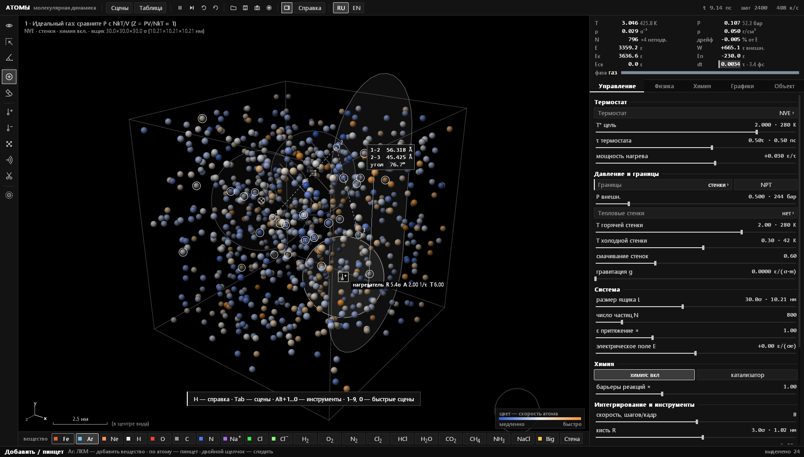<br><sub><b>Объекты поля и измерения.</b> Нагреватель, барьер, выделение и угломер</sub></td>
<td><br><sub><b>Таблица Менделеева.</b> 118 элементов; в карточке — электронная конфигурация и физические свойства</sub></td>
</tr>
<tr>
<td colspan="2" align="center"><br><sub><b>Меню сцен.</b> 46 готовых опытов в двух разделах, у многих есть варианты</sub></td>
</tr>
</table>

## Быстрый старт

1. Скачайте `atoms-windows-x64.zip` со страницы [Releases](https://github.com/felixxxrrr8-afk/atoms-md/releases/latest).
2. Распакуйте в любую папку и запустите `atoms.exe`. Устанавливать ничего не нужно.
3. <kbd>Tab</kbd> — меню сцен, <kbd>E</kbd> — таблица Менделеева, <kbd>H</kbd> — шпаргалка, <kbd>Ctrl</kbd>+<kbd>L</kbd> — русский ↔ English, <kbd>F1</kbd> — полная инструкция.

Нужны Windows 10 или 11 (x64) и любая видеокарта с OpenGL. SmartScreen может предупредить, что у программы нет цифровой подписи: «Подробнее» → «Выполнить в любом случае».

## Сцены

**Вещество**

| Клавиша | Сцена | Что наблюдать |
|---|---|---|
| <kbd>1</kbd> | Идеальный газ | PV = NkT, распределение Максвелла, давление на стенки |
| <kbd>2</kbd> | Плавление кристалла | нагрев постоянной мощностью, плато T(t); варианты — ГПУ, ОЦК, ПК, NaCl, лёд |
| <kbd>3</kbd> | Кипение | жидкость под гравитацией, горячее дно, испарение |
| <kbd>4</kbd> | Конденсация | пересыщенный пар → зародыши → капли |
| <kbd>5</kbd> | Диффузия | смешивание газов, MSD(t) и коэффициент D |
| <kbd>8</kbd> | Броуновское движение | тяжёлая частица среди атомов, MSD ∝ t |
| <kbd>9</kbd> | Закалка | поликристалл, границы зёрен; вариант — стекло |
| <kbd>Shift</kbd>+<kbd>1</kbd> | Наночастица золота | металлическая связь, плавление с поверхности |
| меню | Теплопроводность | горячая и холодная стенки, линейный профиль T(x), закон Фурье и κ |
| меню | Ударная труба | ударная волна и волна разрежения, скорость фронта против теории; вариант — расширение Джоуля |
| меню | Барометрическая формула | ρ ∝ exp(−mgh/kT): тяжёлый Ar ниже лёгкого Ne |
| меню | Эффузия | закон Грэма: He утекает через щели ≈ в 3.2 раза быстрее Ar |
| меню | Спекание наночастиц | Au и Ag срастаются в твёрдом состоянии |
| меню | Адиабатическое сжатие | поршень медленно сжимает гелий: T·V<sup>γ−1</sup> ≈ const |
| меню | Смачивание | угол смачивания капли; вариант — несмачивание |
| меню | Кристаллизация на затравке | переохлаждённая жидкость нарастает на закреплённом кристаллике |
| меню | Течение Пуазейля | параболический профиль скорости в канале |
| меню | Жидкость и пар | плёнка жидкости испаряется до насыщения; плотности против фазовой диаграммы |
| меню | Адсорбция | газ оседает на притягивающих стенках: покрытие θ и давление |
| меню | Выравнивание температур | горячий неон и холодный криптон: энергии равны, скорости разные |
| меню | Кавитация | растянутая жидкость разрывается пузырьками пара |
| меню | Растяжение нанопровода | скольжение, шейка, цепочка атомов и разрыв провода золота |

**Химия**

| Клавиша | Сцена | Что наблюдать |
|---|---|---|
| <kbd>6</kbd> | NaCl в воде | растворение соли, гидратные оболочки |
| <kbd>7</kbd> | Горение водорода | 2H₂ + O₂ → 2H₂O от искры; вариант — H₂ + Cl₂ |
| <kbd>0</kbd> | Химическое равновесие | Cl₂ ⇌ 2Cl под поршнем, принцип Ле Шателье |
| <kbd>Shift</kbd>+<kbd>2</kbd> | Окисление железа | Fe + O₂ → оксид, который отслаивается |
| <kbd>Shift</kbd>+<kbd>3</kbd> | Натрий в хлоре | 2Na + Cl₂ → 2NaCl |
| <kbd>Shift</kbd>+<kbd>4</kbd> | Горение метана | CH₄ + 2O₂ → CO₂ + 2H₂O |
| <kbd>Shift</kbd>+<kbd>5</kbd> | Электрофорез | ионы в воде в электрическом поле, ток I |
| меню | Кислота в воде | HCl + H₂O → H₃O⁺ + Cl⁻, механизм Гроттгуса, pH |
| меню | Нейтрализация | H₃O⁺ + OH⁻ → 2H₂O; вариант — титрование |
| меню | Горение этанола | C₂H₅OH + 3O₂ от искры |
| меню | Гремучая смесь | 2H₂ + O₂ в закрытом сосуде: скачок T и P |
| меню | Катализ на платине | реакция идёт только на поверхности Pt |
| меню | Хлорирование метана | радикальная цепь от УФ-света |
| меню | Равновесие H₂ + I₂ ⇌ 2HI | опыт Боденштейна, K<sub>c</sub> |
| меню | Гидрирование на никеле | C₂H₄ + H₂ → C₂H₆ |
| меню | Разложение пероксида | 2H₂O₂ → 2H₂O + O₂ |
| меню | Горение ацетилена | 2C₂H₂ + 5O₂ → 4CO₂ + 2H₂O |
| меню | H₂ + Br₂ на свету | цепь медленнее хлорной: стадия Br + H₂ эндотермична |
| меню | Хлор вытесняет бром | Cl + HBr → HCl + Br |
| меню | Водород и фтор | H₂ + F₂ → 2HF без искры |
| меню | Распад озона | 2O₃ → 3O₂ при нагреве |
| меню | Горение пропана | C₃H₈ + 5O₂ → 3CO₂ + 4H₂O |
| меню | Взрыв NCl₃ | слабые связи N–Cl уступают прочнейшей N≡N |
| меню | Самовоспламенение | нагрев без искры до температуры вспышки; вариант — H₂ + Cl₂ |

## Управление

| | |
|---|---|
| <kbd>Tab</kbd> | меню сцен (повторный выбор — вариант сцены) |
| <kbd>Ctrl</kbd>+<kbd>L</kbd> · <kbd>F1</kbd> | язык интерфейса · инструкция |
| <kbd>Пробел</kbd> · <kbd>S</kbd> · <kbd>R</kbd> | пауза · один шаг · сброс сцены |
| <kbd>E</kbd> | таблица Менделеева |
| <kbd>Alt</kbd>+<kbd>1</kbd>…<kbd>0</kbd>, <kbd>Alt</kbd>+<kbd>F</kbd> | инструменты и объекты поля |
| ЛКМ · ПКМ · <kbd>Shift</kbd>+ПКМ | инструмент · нагреть · охладить |
| <kbd>Ctrl</kbd>+ЛКМ, колесо | камера: вращение и масштаб; <kbd>V</kbd> — полёт, <kbd>X</kbd> — разрез |
| <kbd>C</kbd> · <kbd>B</kbd> · <kbd>T</kbd> | раскраска атомов · связи · следы |
| <kbd>L</kbd> · <kbd>K</kbd> · <kbd>U</kbd> | вспышка света · зона катализатора · обратить время |
| <kbd>Ctrl</kbd>+<kbd>Z</kbd> | отмена |
| <kbd>F5</kbd> / <kbd>F9</kbd>, <kbd>Ctrl</kbd>+<kbd>S</kbd> / <kbd>Ctrl</kbd>+<kbd>O</kbd> | быстрое и обычное сохранение и загрузка `.atoms` |
| <kbd>F12</kbd> · <kbd>Ctrl</kbd>+<kbd>F12</kbd> · <kbd>Ctrl</kbd>+<kbd>E</kbd> | снимок PNG · запись кадров · экспорт графиков в CSV |

Все клавиши, инструменты и объяснение физики — в [ИНСТРУКЦИЯ.html](ИНСТРУКЦИЯ.html) (в программе — <kbd>F1</kbd>). Английская версия — [MANUAL.html](MANUAL.html). Обе лежат в архиве релиза.

## Как это устроено

Один шаг моделирования (`mdStep` в [`src/physics.inl`](src/physics.inl)):

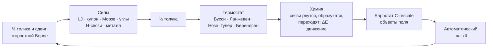

**Взаимодействия.** Ван-дер-ваальс — потенциал Леннард-Джонса с правилами Лоренца–Бертло. Электростатика — экранированный кулон, заряды считаются из электроотрицательностей. Ковалентные связи — потенциал Морзе, валентные углы по VSEPR (тетраэдр у sp³-углерода, NH₄⁺ и BH₄⁻, пирамида у NH₃ и H₃O⁺, плоский треугольник у BF₃) и кратные связи. Водородные связи — направленный член DREIDING, у воды ещё трёхчастичный член тетраэдричности, как в модели mW. Металлы — многочастичный потенциал Гупты (Клери–Розато).

**Химия.** Реакции — события в той же молекулярной динамике. Связь образуется, когда у сблизившихся атомов есть свободная валентность; рвётся, когда перерастянута; атом переходит к другому партнёру, если преодолён барьер. Энергия каждого события считается точно, так что горение само разогревает смесь. Энергии и длины связей — справочные для ~70 пар атомов (H–F, N–F, P–F, Si–F, B–F, S–Cl, межгалогенные и другие), для остальных — по правилам Полинга. Барьеры — по правилу Эванса–Поляни.

**Единицы.** Модель откалибрована по аргону: σ = 0.3405 нм, ε/k = 139.8 K подобрано так, чтобы критическая точка модели совпала с аргоном (150.7 K). Тогда тройная точка получается ≈ 87 K при опытных 83.8 K, а плотность жидкости у неё — 1.39 г/см³ против 1.41.

**Надёжность.** Страж устойчивости держит снимки состояния и при «взрыве» откатывается назад с уменьшенным шагом. Всё, что делает пользователь, учитывается как внешняя работа W, поэтому E − W сохраняется и по её дрейфу видна честность интегрирования.

### Проверки без окна

```bash
atoms.exe --selftest                 # все сцены меню: устойчивость, дрейф энергии, NaN
atoms.exe --gradcheck K N            # силы против −∇U численным дифференцированием
atoms.exe --evcheck K N              # точный баланс энергии каждой реакции
atoms.exe --kin K N T V              # длинный прогон сцены: фаза, реакции, живое измерение
atoms.exe --phystest РЕЖИМ K N       # coex, melt, triple, npt, vir, fo, guard
atoms.exe --chemtest lib             # вставить каждую структуру библиотеки и проверить, что она цела
atoms.exe --uitest [--langcheck]     # прокликать весь интерфейс; список непереведённых строк
atoms.exe --lang ru --shot K N png   # отрисовать сцену K и сохранить снимок окна
```

Отчёты пишутся в `.log` рядом с программой. Скриншоты здесь сделаны командой `--shot`.

## Сборка из исходников

Внешних библиотек нет: хватает MSVC из Visual Studio или Build Tools.

```bash
build.bat
```

`build.bat` сам находит Visual Studio; `build.bat asan` собирает отладочную версию с AddressSanitizer. Вручную из x64 Native Tools Command Prompt:

```bash
rc /nologo atoms.rc
cl /O2 /openmp /utf-8 /EHsc /std:c++17 /fp:fast main.cpp atoms.res /Fe:atoms.exe /link /SUBSYSTEM:WINDOWS user32.lib gdi32.lib opengl32.lib comdlg32.lib shell32.lib
```

Каждый push в `main` собирается в [GitHub Actions](https://github.com/felixxxrrr8-afk/atoms-md/actions); новая `ProductVersion` в `atoms.rc` публикует новый релиз.

### Структура

Одна единица трансляции: `main.cpp` подключает модули из `src/` по порядку, около 10 000 строк и таблица перевода.

| Файл | Что внутри |
|---|---|
| [`main.cpp`](main.cpp) | точка входа и список режимов без окна |
| [`src/core.inl`](src/core.inl) | константы, элементы и их свойства, состояние системы |
| [`src/physics.inl`](src/physics.inl) | силы, списки соседей, интегратор, термостаты, баростат, объекты поля, страж |
| [`src/chemistry.inl`](src/chemistry.inl) | реакции, заряды и ионы, pH, таблица связей, библиотека структур |
| [`src/analysis.inl`](src/analysis.inl) | измерения для графиков, локальная структура, фаза каждого атома |
| [`src/presets.inl`](src/presets.inl) | сцены, их живые измерения, отмена |
| [`src/render.inl`](src/render.inl) | отрисовка на OpenGL и камера |
| [`src/ui.inl`](src/ui.inl) | панели, инструменты, графики, таблица Менделеева, меню сцен |
| [`src/panel_phys.inl`](src/panel_phys.inl), [`src/panel_chem.inl`](src/panel_chem.inl) | вкладки «Физика» и «Химия», их проверки без окна |
| [`src/app.inl`](src/app.inl) | окно и главный цикл, ввод, сохранение, PNG, самопроверки |
| [`src/lang.inl`](src/lang.inl), [`src/lang_table.inl`](src/lang_table.inl) | переключение языка и таблица «русский → английский» |
| [`tools/i18n.py`](tools/i18n.py) | извлечение строк интерфейса и проверка таблицы перевода |

## Упрощения

Механика классическая, без квантовых эффектов. На каждую пару атомов одна кривая связи, перенос электронов явно не моделируется: окисление идёт через связи. Гипервалентные молекулы (SO₂, SF₆, PCl₅, HNO₃) валентной модели недоступны. Энергии связей уменьшены (1 эВ = 4ε), а реакции ускорены, иначе за доступное время моделирования ничего бы не произошло. Самоионизация воды не учитывается: в ящике объёмом ~10⁻²³ л её равновесие — ноль ионов.

## Лицензия

[GPL-3.0](LICENSE). Код можно использовать, изучать и менять; производные программы распространяются с исходниками под той же лицензией.
