<div align="center">

[English](README.md) · **Русский**

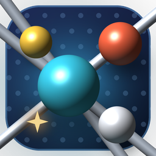

# Атомы

**Молекулярная динамика и химия в реальном времени — в 2D и 3D**

Газ, жидкость, кристалл, фазовые переходы и химические реакции здесь не нарисованы заранее:<br>
они возникают сами из потенциалов взаимодействия и законов сохранения.

[](https://github.com/felixxxrrr8-afk/atoms-md/actions/workflows/build.yml)
[](https://github.com/felixxxrrr8-afk/atoms-md/releases/latest)


[](LICENSE)

### [⬇ Скачать для Windows](https://github.com/felixxxrrr8-afk/atoms-md/releases/latest)

[Возможности](#возможности) · [Сцены](#сцены) · [Управление](#управление) · [Физика](#как-это-устроено) · [Сборка](#сборка-из-исходников)

<br>

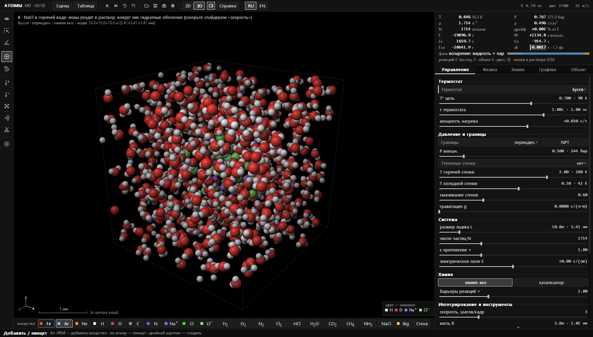

<sub>Кристаллик NaCl растворяется в горячей воде: ионы уходят в раствор, вокруг них собираются гидратные оболочки</sub>

</div>

<br>

## Возможности

<table>
<tr>
<td width="50%" valign="top">

**Физика**
- 2D и 3D, переключение одной клавишей <kbd>D</kbd>
- Леннард-Джонс, экранированный кулон, связи Морзе, валентные углы, водородные связи, многочастичная металлическая связь
- Термостаты Бусси, Ланжевена, Нозе–Гувера, Берендсена; баростат NPT
- Баланс энергии с учётом всей работы извне: дрейф виден на графике

</td>
<td width="50%" valign="top">

**Химия**
- Связи образуются, рвутся и переходят между атомами; теплота реакции уходит в движение
- Горение, кислоты и основания, прыжки протона по Гроттгусу, pH
- Катализ на поверхности металлов, фотодиссоциация светом
- Все 118 элементов таблицы Менделеева и библиотека из 32 структур

</td>
</tr>
<tr>
<td valign="top">

**Инструменты**
- Пинцет, кисть нагрева и охлаждения, ластик, ножницы для связей, ударная волна
- Объекты поля: притягатель, нагреватель, ветер, вихрь, ловушка, источник, сток, барьер
- Выделение, копирование, закрепление атомов; линейка и угломер

</td>
<td valign="top">

**Анализ**
- T, P, плотность и энергии — в модельных и настоящих единицах
- Фаза каждого атома, фазовая диаграмма T–ρ, журнал переходов
- g(r), распределение Максвелла, MSD и коэффициент диффузии
- Журнал реакций с ΔH, k и K<sub>c</sub>; экспорт графиков в CSV

</td>
</tr>
</table>

## Скриншоты

<table>
<tr>
<td width="50%">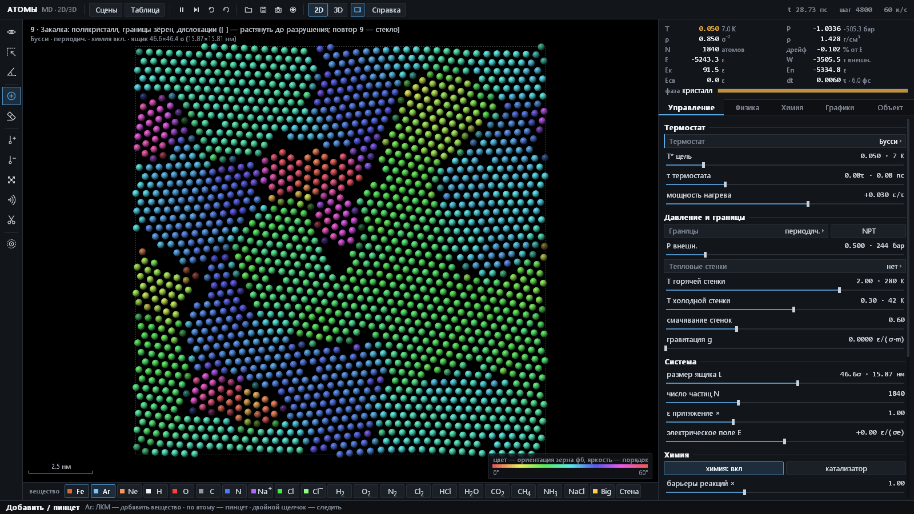<br><sub><b>Закалка.</b> Поликристалл: цвет — ориентация зерна, видны границы зёрен и дислокации</sub></td>
<td width="50%">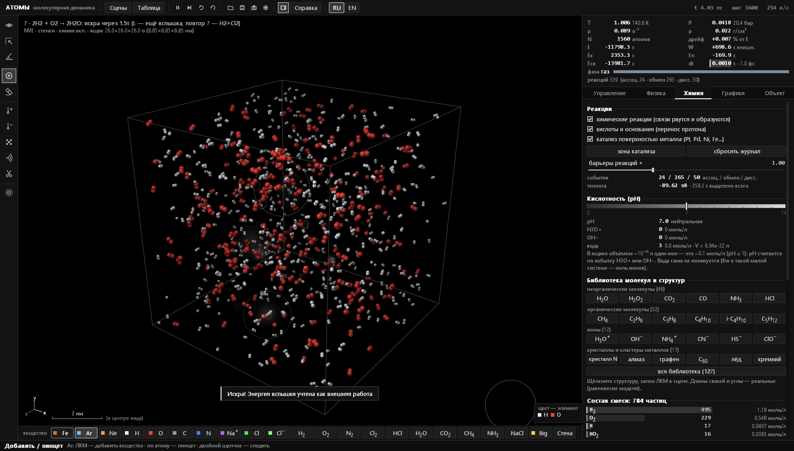<br><sub><b>Горение водорода.</b> 2H₂ + O₂ → 2H₂O от искры, справа — журнал событий и состав смеси</sub></td>
</tr>
<tr>
<td>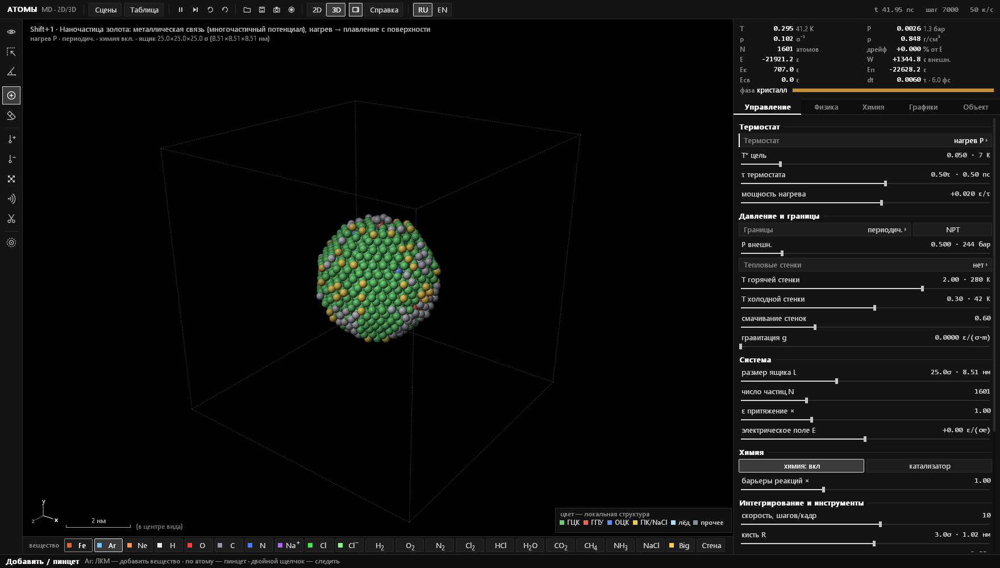<br><sub><b>Наночастица золота.</b> Цвет — локальная структура: ГЦК внутри, плавление начинается с поверхности</sub></td>
<td>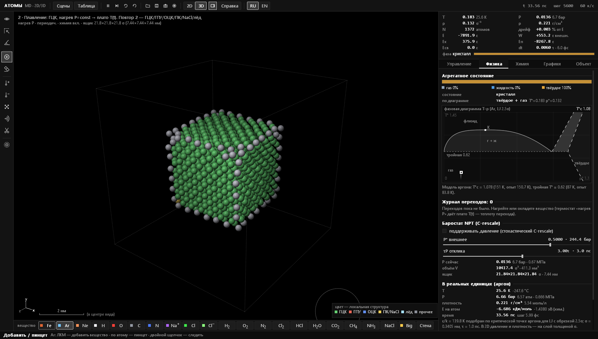<br><sub><b>Плавление кристалла.</b> Вкладка «Физика»: фазовая диаграмма модели и трасса состояния</sub></td>
</tr>
<tr>
<td>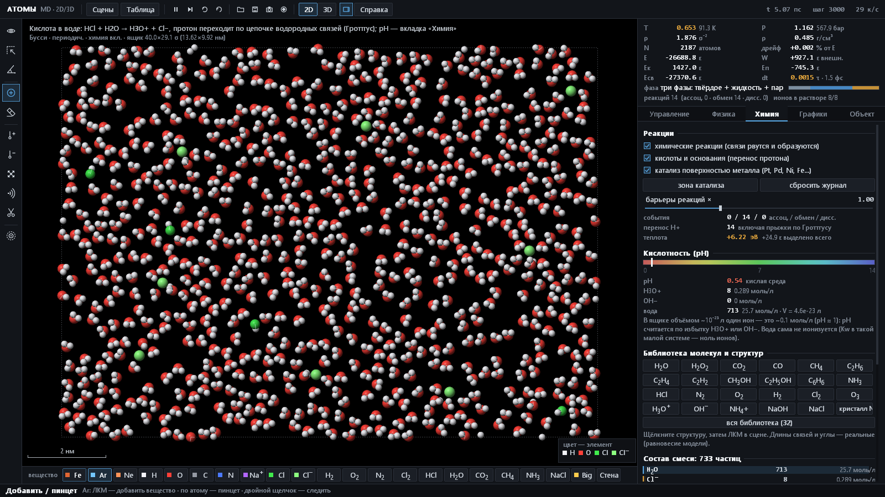<br><sub><b>Кислота в воде.</b> HCl + H₂O → H₃O⁺ + Cl⁻, шкала pH и счётчик переносов протона</sub></td>
<td>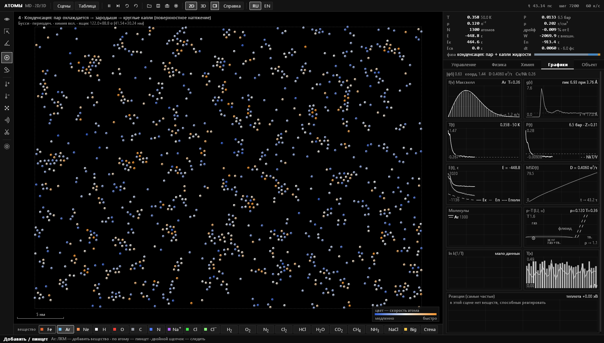<br><sub><b>Конденсация.</b> Пересыщенный пар собирается в капли; графики f(v), g(r), T, P, E, MSD</sub></td>
</tr>
<tr>
<td>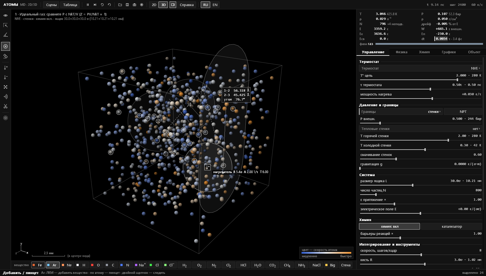<br><sub><b>Объекты поля и измерения.</b> Нагреватель, барьер, выделение и угломер в 3D</sub></td>
<td><br><sub><b>Катализ на платине.</b> H₂ + O₂ реагируют только на поверхности наночастицы Pt</sub></td>
</tr>
<tr>
<td>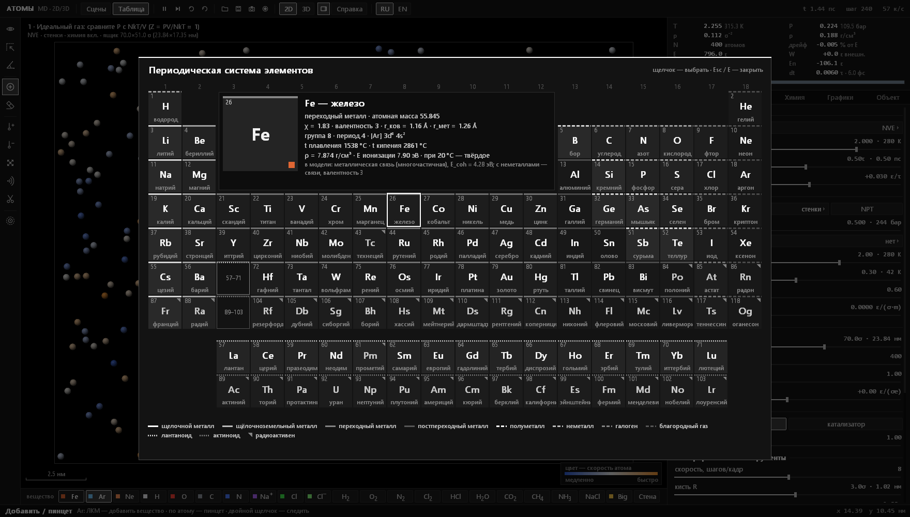<br><sub><b>Таблица Менделеева.</b> 118 элементов с карточками: как каждый устроен в модели</sub></td>
<td>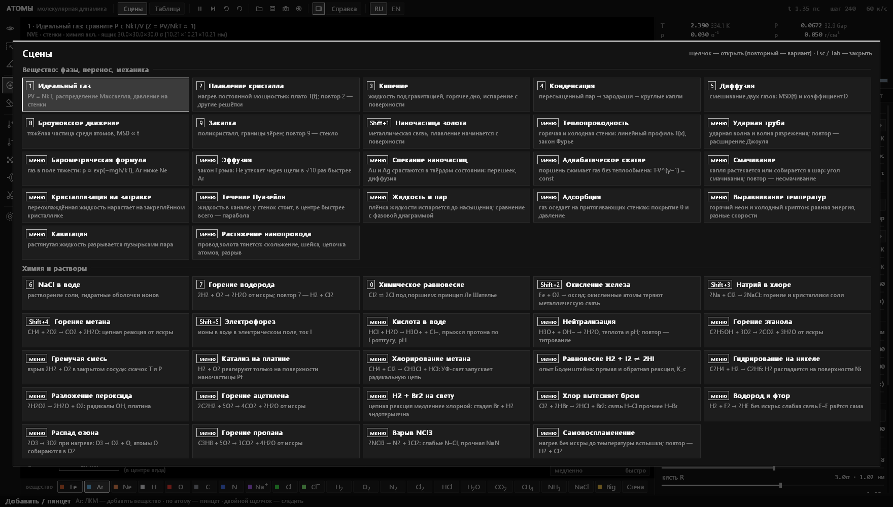<br><sub><b>Меню сцен.</b> 20 готовых опытов, у многих есть варианты</sub></td>
</tr>
</table>

## Быстрый старт

1. Скачайте `atoms-windows-x64.zip` со страницы [Releases](https://github.com/felixxxrrr8-afk/atoms-md/releases/latest).
2. Распакуйте в любую папку и запустите `atoms.exe`. Устанавливать ничего не нужно.
3. <kbd>Tab</kbd> — меню сцен, <kbd>D</kbd> — 2D ↔ 3D, <kbd>E</kbd> — таблица Менделеева, <kbd>H</kbd> — шпаргалка, <kbd>F1</kbd> — полная инструкция.

Нужны Windows 10 или 11 (x64) и любая видеокарта с OpenGL. SmartScreen может предупредить, что программа без цифровой подписи: «Подробнее» → «Выполнить в любом случае».

## Сцены

| Клавиша | Сцена | Что наблюдать |
|---|---|---|
| <kbd>1</kbd> | Идеальный газ | PV = NkT, распределение Максвелла, давление на стенки |
| <kbd>2</kbd> | Плавление кристалла | нагрев постоянной мощностью, плато T(t); варианты — другие решётки |
| <kbd>3</kbd> | Кипение | жидкость под гравитацией, горячее дно, испарение |
| <kbd>4</kbd> | Конденсация | пересыщенный пар → зародыши → капли |
| <kbd>5</kbd> | Диффузия | смешивание газов, MSD(t) и коэффициент D |
| <kbd>6</kbd> | NaCl в воде | растворение соли, гидратные оболочки |
| <kbd>7</kbd> | Горение водорода | 2H₂ + O₂ → 2H₂O от искры; вариант — H₂ + Cl₂ |
| <kbd>8</kbd> | Броуновское движение | тяжёлая частица, MSD ∝ t |
| <kbd>9</kbd> | Закалка | поликристалл, границы зёрен; вариант — стекло |
| <kbd>0</kbd> | Химическое равновесие | Cl₂ ⇌ 2Cl под поршнем, принцип Ле Шателье |
| <kbd>Shift</kbd>+<kbd>1</kbd> | Наночастица золота | металлическая связь, плавление с поверхности |
| <kbd>Shift</kbd>+<kbd>2</kbd> | Окисление железа | Fe + O₂ → оксид |
| <kbd>Shift</kbd>+<kbd>3</kbd> | Натрий в хлоре | 2Na + Cl₂ → 2NaCl |
| <kbd>Shift</kbd>+<kbd>4</kbd> | Горение метана | CH₄ + 2O₂ → CO₂ + 2H₂O |
| <kbd>Shift</kbd>+<kbd>5</kbd> | Электрофорез | ионы в воде в электрическом поле, ток I |
| меню | Кислота в воде | HCl + H₂O → H₃O⁺ + Cl⁻, механизм Гроттгуса, pH ≈ 0.3 |
| меню | Нейтрализация | H₃O⁺ + OH⁻ → 2H₂O, pH идёт к 7; вариант — титрование |
| меню | Горение этанола | C₂H₅OH + 3O₂ от искры |
| меню | Гремучая смесь | 2H₂ + O₂ в закрытом сосуде: скачок T и P |
| меню | Катализ на платине | реакция идёт только на поверхности Pt |

## Управление

| | |
|---|---|
| <kbd>Tab</kbd> | меню сцен (повторный выбор — вариант сцены) |
| <kbd>D</kbd> | 2D / 3D |
| <kbd>Пробел</kbd> · <kbd>S</kbd> · <kbd>R</kbd> | пауза · один шаг · сброс сцены |
| <kbd>E</kbd> | таблица Менделеева |
| <kbd>Alt</kbd>+<kbd>1</kbd>…<kbd>0</kbd>, <kbd>Alt</kbd>+<kbd>F</kbd> | инструменты и объекты поля |
| ЛКМ · ПКМ · <kbd>Shift</kbd>+ПКМ | инструмент · нагреть · охладить |
| <kbd>Ctrl</kbd>+ЛКМ, колесо | камера: вращение и масштаб |
| <kbd>C</kbd> · <kbd>B</kbd> · <kbd>T</kbd> | раскраска атомов · связи · следы |
| <kbd>L</kbd> · <kbd>K</kbd> | вспышка света · зона катализатора |
| <kbd>U</kbd> | обратить время |
| <kbd>Ctrl</kbd>+<kbd>Z</kbd> | отмена |
| <kbd>F5</kbd> / <kbd>F9</kbd>, <kbd>Ctrl</kbd>+<kbd>S</kbd> / <kbd>Ctrl</kbd>+<kbd>O</kbd> | быстрое и обычное сохранение и загрузка `.atoms` |
| <kbd>F12</kbd> · <kbd>Ctrl</kbd>+<kbd>F12</kbd> · <kbd>Ctrl</kbd>+<kbd>E</kbd> | снимок PNG · запись кадров · экспорт графиков в CSV |

Все клавиши, инструменты и объяснение физики — в [ИНСТРУКЦИЯ.html](ИНСТРУКЦИЯ.html) (в программе открывается по <kbd>F1</kbd>). Английская версия — [MANUAL.html](MANUAL.html). Обе лежат в архиве релиза.

## Как это устроено

Один шаг моделирования (`mdStep` в [`src/physics.inl`](src/physics.inl)):

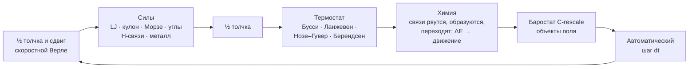

**Взаимодействия.** Ван-дер-ваальс — потенциал Леннард-Джонса с правилами Лоренца–Бертло. Электростатика — экранированный кулон, заряды атомов считаются из электроотрицательностей. Ковалентные связи — потенциал Морзе, валентные углы по VSEPR, кратные связи. Водородные связи — направленный член DREIDING, у воды ещё трёхчастичный член тетраэдричности, как в модели mW. Металлы — многочастичный потенциал Гупты (Клери–Розато), поэтому поверхности, плавление и огранка наночастиц выглядят правдоподобно.

**Химия.** Реакции — это события в той же молекулярной динамике, а не анимация. Связь образуется, когда у сблизившихся атомов есть свободная валентность; рвётся, когда перерастянута; атом переходит к другому партнёру, если преодолён барьер. Энергия каждого события считается точно, так что горение само разогревает смесь. Энергии связей — табличные для ~60 пар, для остальных — правила Полинга. Барьеры — по правилу Эванса–Поляни.

**Единицы.** Модель откалибрована по аргону: σ = 0.3405 нм, ε/k = 139.8 K подобрано так, чтобы критическая точка модели совпала с аргоном (150.7 K). Тройная точка получается ≈ 87 K при опытных 83.8 K. Программа везде показывает и модельные, и настоящие величины: K, бар, г/см³, пс, кДж/моль.

**Надёжность.** Страж устойчивости держит снимки состояния и при «взрыве» откатывается назад с уменьшенным шагом. Всё, что делает пользователь (нагрев, толчки, вставка атомов), учитывается как внешняя работа W, поэтому величина E − W сохраняется и по её дрейфу видна честность интегрирования.

### Проверки без окна

```bash
atoms.exe --selftest                 # все сцены в 2D и 3D: устойчивость, дрейф энергии, NaN
atoms.exe --gradcheck D K N          # силы против −∇U численным дифференцированием
atoms.exe --evcheck D K N            # точный баланс энергии каждой реакции
atoms.exe --kin K D N T V            # длинный прогон сцены: фаза, реакции, состав
atoms.exe --phystest РЕЖИМ D K N     # coex, melt, npt, vir, fo, guard
atoms.exe --shot K N [3d] png        # отрисовать сцену K и сохранить снимок окна
```

Отчёты пишутся в `.log` рядом с программой. Скриншоты в этом README сделаны командой `--shot`.

## Сборка из исходников

Внешних библиотек нет: хватает MSVC из Visual Studio или Build Tools (C++17, Win32, OpenGL 1.x, OpenMP).

```bash
build.bat
```

`build.bat` сам находит Visual Studio и собирает `atoms.exe` рядом с исходниками. `build.bat asan` собирает отладочную версию с AddressSanitizer. Вручную из x64 Native Tools Command Prompt:

```bash
rc /nologo atoms.rc
cl /O2 /openmp /utf-8 /EHsc /std:c++17 /fp:fast main.cpp atoms.res /Fe:atoms.exe /link /SUBSYSTEM:WINDOWS user32.lib gdi32.lib opengl32.lib comdlg32.lib shell32.lib
```

Каждый push в `main` собирается в [GitHub Actions](https://github.com/felixxxrrr8-afk/atoms-md/actions), и релиз текущей версии получает свежий архив. Когда в `atoms.rc` меняется `ProductVersion`, автоматически публикуется новый релиз.

### Структура

Весь код — одна единица трансляции: `main.cpp` подключает модули из `src/` по порядку, около 9 000 строк.

| Файл | Что внутри |
|---|---|
| [`main.cpp`](main.cpp) | точка входа, порядок подключения модулей |
| [`src/core.inl`](src/core.inl) | константы, элементы, состояние системы |
| [`src/physics.inl`](src/physics.inl) | энергии и силы, списки соседей, интегратор, термостаты, баростат, объекты поля, страж |
| [`src/chemistry.inl`](src/chemistry.inl) | реакции, молекулы и заряды, ионные события, pH, библиотека структур |
| [`src/analysis.inl`](src/analysis.inl) | измерения для графиков, агрегатное состояние каждого атома |
| [`src/presets.inl`](src/presets.inl) | сцены и их варианты, отмена действий |
| [`src/render.inl`](src/render.inl) | отрисовка 2D и 3D на OpenGL, камера |
| [`src/ui.inl`](src/ui.inl) | интерфейс: панели, инструменты, графики, таблица Менделеева, меню сцен |
| [`src/panel_phys.inl`](src/panel_phys.inl), [`src/panel_chem.inl`](src/panel_chem.inl) | вкладки «Физика» и «Химия», их проверки без окна |
| [`src/app.inl`](src/app.inl) | окно и главный цикл, клавиатура и мышь, сохранение, PNG, самопроверки |

## Упрощения

Механика классическая, без квантовых эффектов. На каждую пару атомов одна кривая связи, перенос электронов явно не моделируется: окисление идёт через связи. Энергии связей уменьшены (1 эВ = 4ε), а скорости реакций ускорены, иначе за доступное время моделирования ничего бы не произошло. Самоионизация воды не учитывается: в ящике объёмом ~10⁻²³ л её равновесие — ноль ионов.

## Лицензия

[GPL-3.0](LICENSE). Можно использовать, изучать и изменять код; производные программы тоже должны распространяться с открытым исходным кодом под GPL-3.0.
